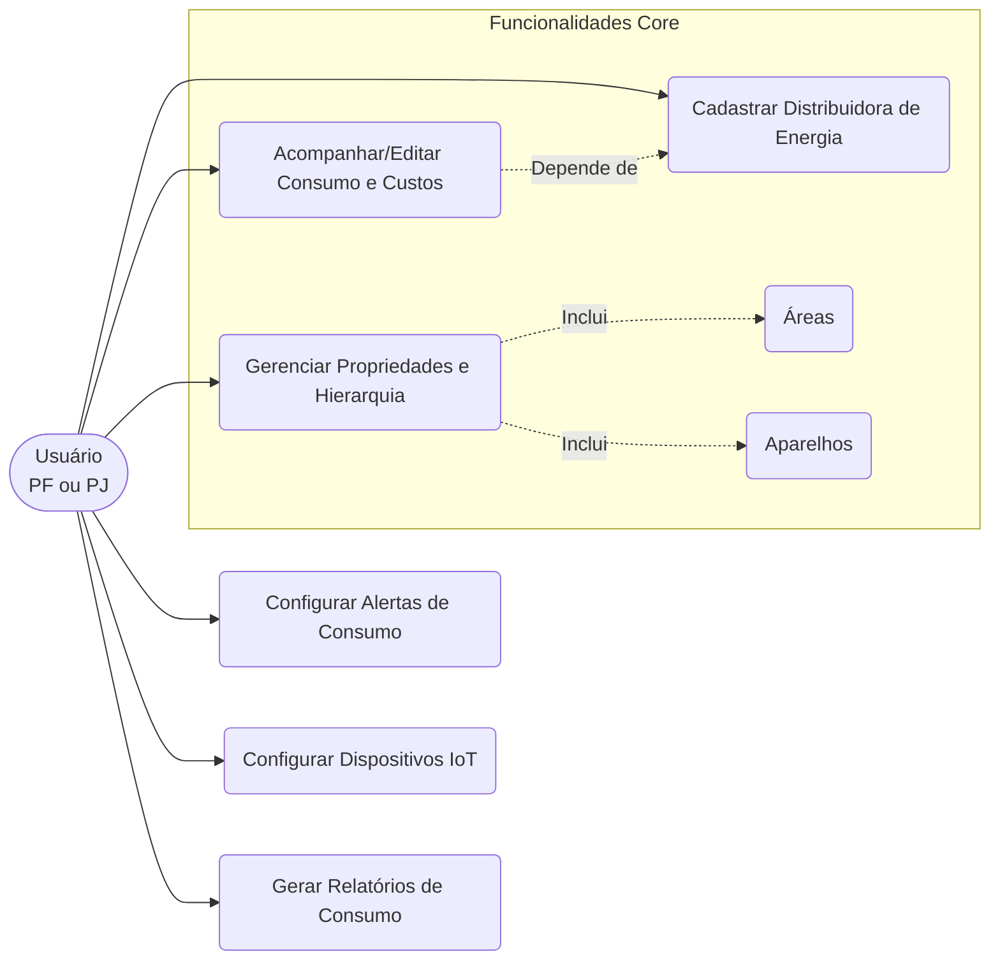
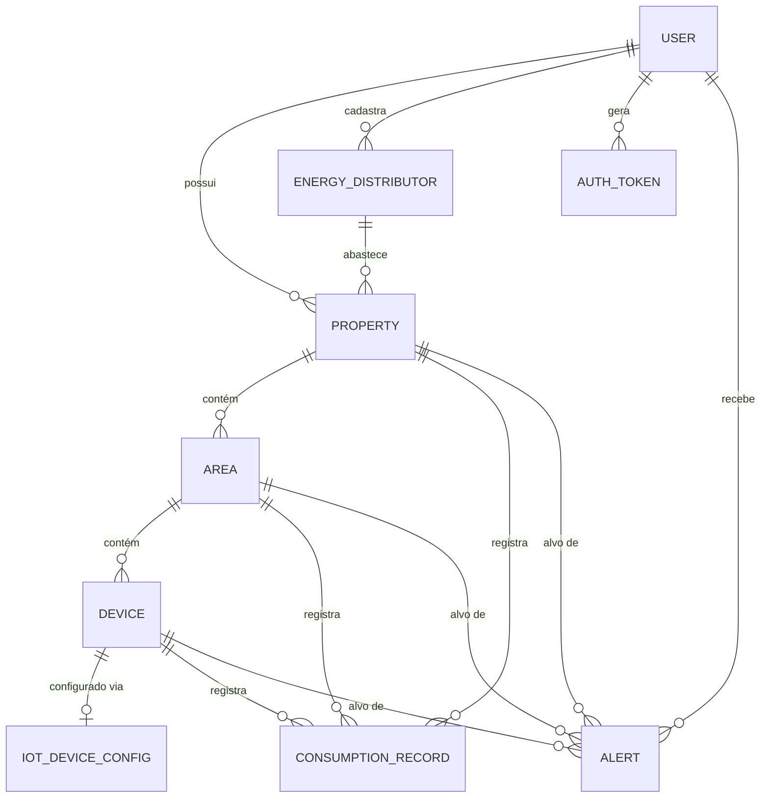
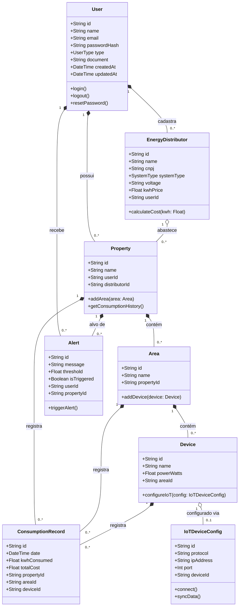
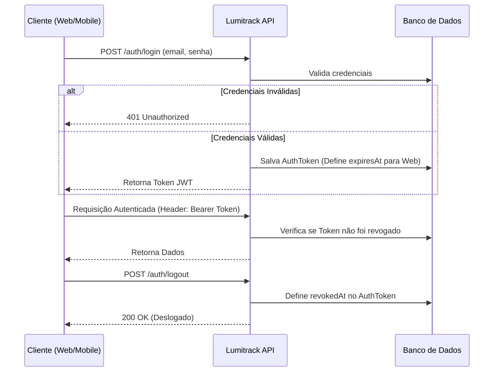
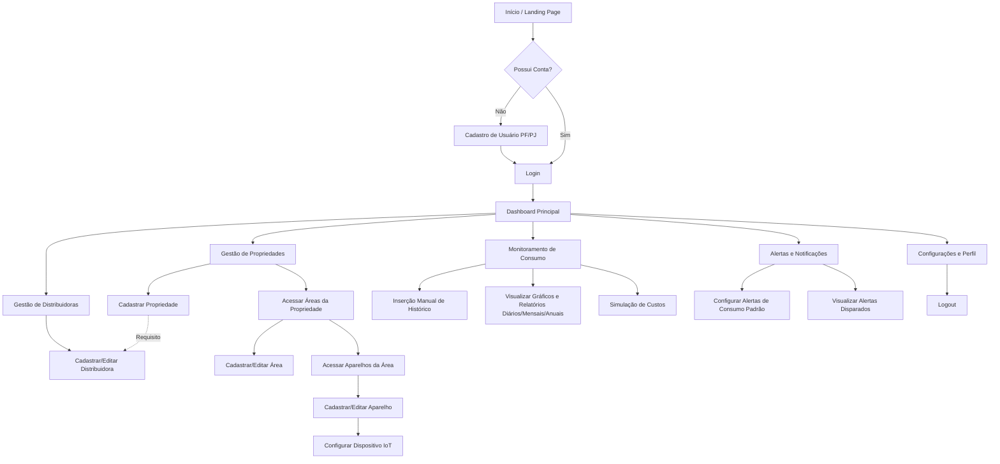

# ⚡ LumiTrack

Projeto do 2º período do curso de Análise e Desenvolvimento de Sistemas - PUC-MG

O Lumitrack é uma aplicação focada no monitoramento e gerenciamento do consumo de energia elétrica para propriedades residenciais, comerciais e industriais. O sistema permite registrar o consumo em tempo real, fornecendo um histórico detalhado por propriedade, áreas específicas e aparelhos. Além de gerar relatórios diários, mensais e anuais, o Lumitrack é capaz de identificar tendências de consumo e disparar alertas quando o uso de energia foge do padrão.

## Principais Funcionalidades

### Autenticação e Segurança: Sistema de login baseado em tokens JWT

- Controle de expiração: tokens da web possuem prazo de validade, enquanto os de dispositivos móveis não expiram por tempo.
- Revogação de tokens em caso de logout ou término do prazo.
- Recuperação de senha segura através de e-mail.

### Gestão de Usuários

- Suporte para cadastro de Pessoa Física (residencial) e Pessoa Jurídica (comercial/industrial).

### Hierarquia de Monitoramento

- **Propriedades:** Cadastro de múltiplas propriedades vinculadas exclusivamente ao usuário.
- **Áreas:** Divisão lógica das propriedades em várias áreas, pertencentes apenas àquela propriedade.
- **Aparelhos:** Cadastro de aparelhos específicos dentro de cada área.

### Distribuidoras de Energia

- Cadastro obrigatório das companhias de distribuição (com CNPJ, tipo de sistema, tensão e preço do kWh).
- Vinculação obrigatória de uma distribuidora à propriedade.

### Histórico e Alertas

- Visualização, inserção, edição e exclusão de histórico de consumo diário, mensal ou anual.
- Configuração de alertas personalizáveis para consumo fora do padrão nos níveis de propriedade, área ou aparelho.

### Integração IoT

- Configuração de dispositivos IoT através de protocolos como MQTT, Modbus, EtherNet/IP, RS485, etc., para coleta de dados em tempo real.

## Tecnologias Utilizadas

### Back-end (em desenvolvimento)

- **Linguagem & Framework:** Node.js (TypeScript) + Express
- **Banco de Dados:** PostgreSQL com Prisma ORM
- **Validação de Dados:** Zod
- **Segurança & Criptografia:** Bcrypt.js, Helmet, CORS e JSON Web Tokens (JWT).
- **Testes (TDD):** Vitest (Testes unitários, integração e E2E) e Supertest.

### Front-end (Planejado)

- React com Next.js (TypeScript)

### Mobile (Planejado)

- Mobile: React Native (TypeScript)

## Diagramas do Sistema

### 1. Diagrama de Casos de Uso

Principais interações dos atores (Pessoa Física ou Jurídica) com o sistema.

### 2. Diagrama Entidade-Relacionamento (ER)

### 3. Diagrama de Classes da Aplicação

Reflete a estrutura de dados baseada nas entidades do sistema.

### 4. Diagrama de Fluxo de Autenticação e Autorização

Representa o ciclo de vida dos tokens web e mobile.

### 5. Diagrama de Fluxo do Usuário (PF/PJ)

Ilustra a jornada de um usuário (Pessoa Física ou Pessoa Jurídica) desde o acesso à plataforma até a utilização das principais funcionalidades (cadastro de hierarquias, visualização de consumo e configuração de alertas/IoT).

