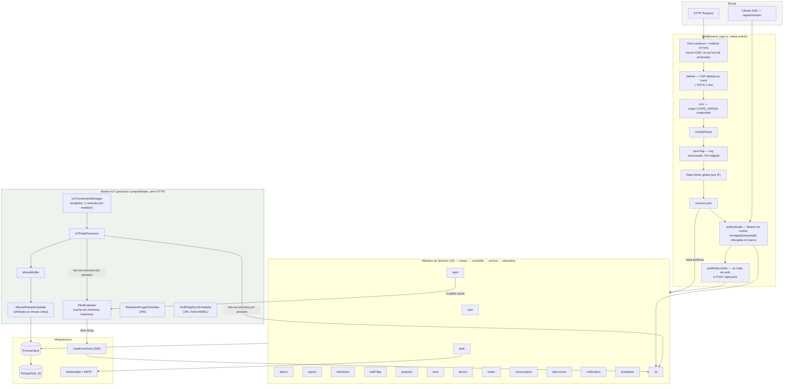
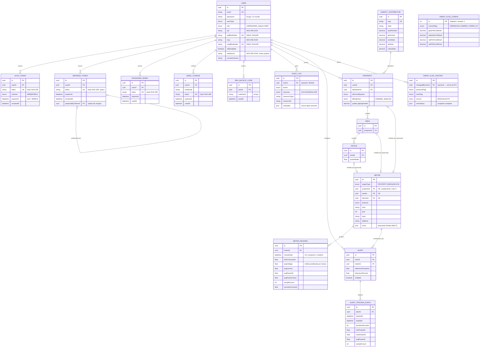
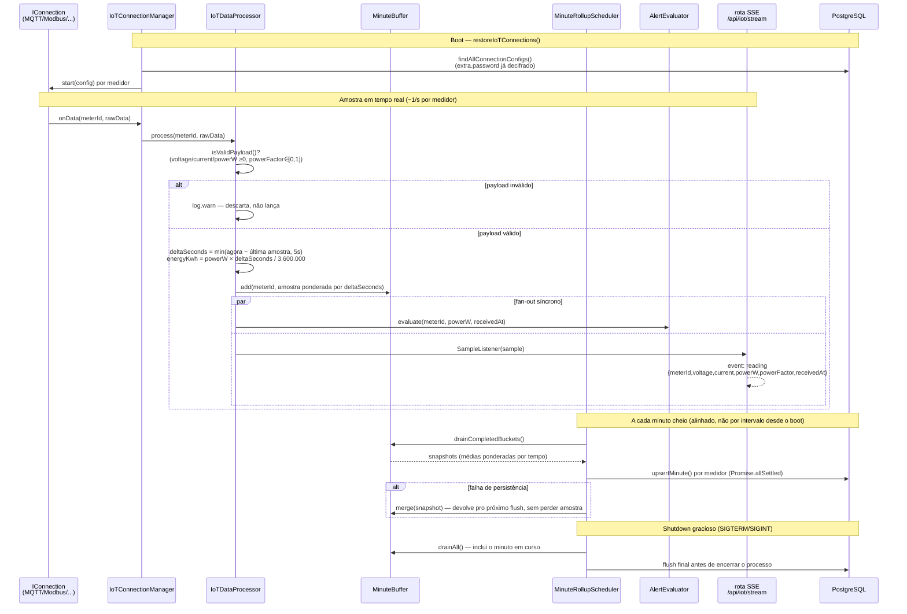
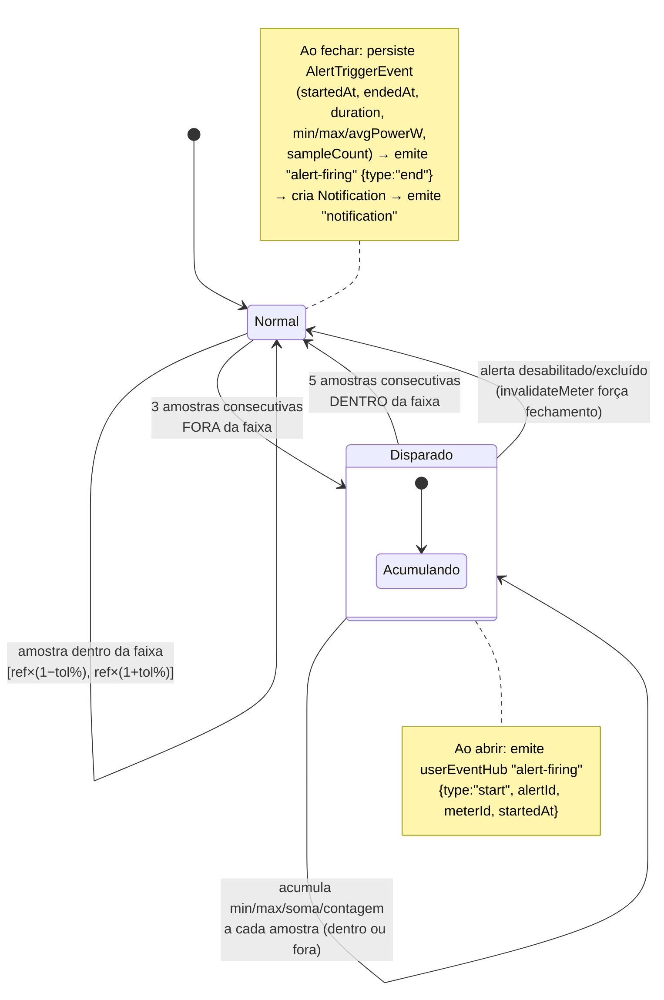
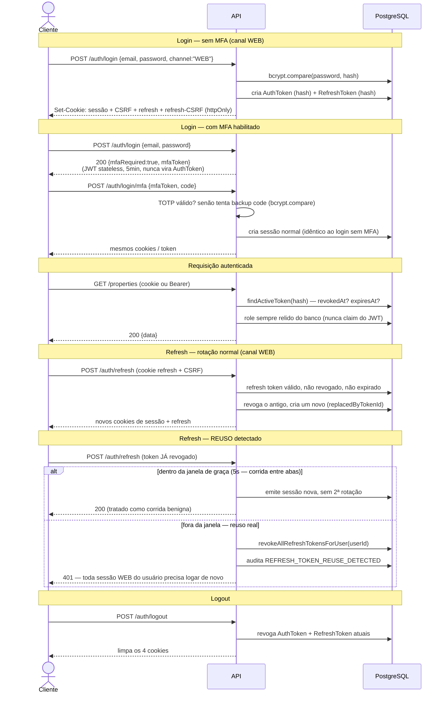
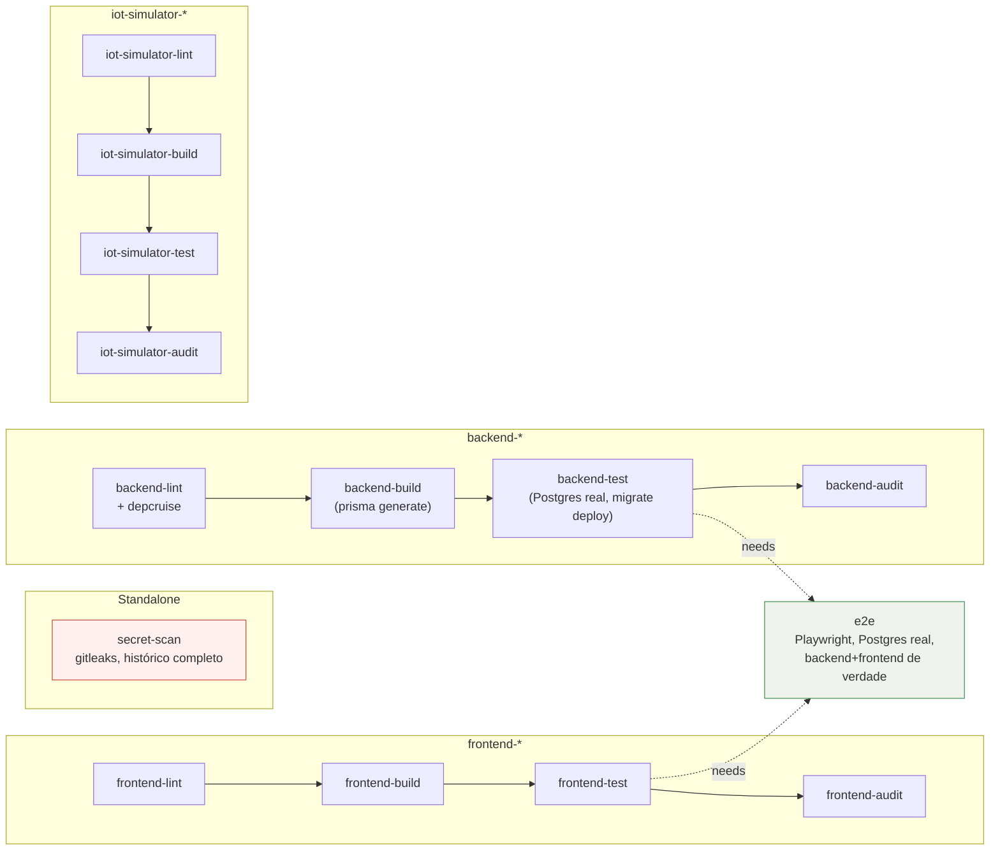

# ⚡ LumiTrack — Backend

API REST + worker de ingestão IoT do LumiTrack. Node.js 24, Express 5, TypeScript strict, Prisma 7, PostgreSQL 16 — monólito modular por domínio, 16 módulos com fronteiras impostas mecanicamente por dependency-cruiser.

## Índice

- [Visão geral](#visão-geral)
- [Arquitetura e stack](#arquitetura-e-stack)
- [Módulos](#módulos)
- [Diagramas](#diagramas)
  - [Arquitetura em camadas](#1-arquitetura-em-camadas)
  - [Entidade-relacionamento (ERD)](#2-entidade-relacionamento-erd)
  - [Sequência da ingestão IoT (FNC001)](#3-sequência-da-ingestão-iot-fnc001)
  - [Ciclo de vida de um alerta (FNC002)](#4-ciclo-de-vida-de-um-alerta-fnc002)
  - [Fluxo de autenticação, refresh rotacionado e MFA](#5-fluxo-de-autenticação-refresh-rotacionado-e-mfa)
  - [Pipeline de CI](#6-pipeline-de-ci)
- [Como executar (desenvolvimento)](#como-executar-desenvolvimento)
- [Deploy em produção](#deploy-em-produção)
- [Variáveis de ambiente](#variáveis-de-ambiente)
- [Scripts npm](#scripts-npm)
- [Testes](#testes)
- [API Reference](#api-reference)
- [Estrutura de pastas](#estrutura-de-pastas)
- [Códigos de status HTTP](#códigos-de-status-http)

## Visão geral

O backend expõe uma API HTTP para a hierarquia do consumidor (Propriedade → Área → Aparelho), autenticação com sessão dupla (cookie `HttpOnly` no canal Web, Bearer no canal Mobile), e um worker interno que ingere leituras elétricas de medidores IoT em tempo real, agrega por minuto, avalia alertas por faixa de potência e transmite tudo via SSE.

Padrão de camadas por módulo:

```text
*.routes.ts → *.controller.ts → *.service.ts → *.repository.ts
```

- **`*.schema.ts`** — validação Zod na borda, antes de qualquer lógica.
- **`*.controller.ts`** — tradução HTTP ↔ domínio, sem regra de negócio.
- **`*.service.ts`** — regra de negócio, testável sem Express nem banco (repository mockado).
- **`*.repository.ts`** — único ponto de acesso ao Prisma daquele módulo; módulos nunca leem tabela de outro módulo diretamente.
- Módulos sem estado próprio persistido (`simulation`) omitem `*.repository.ts`.

Injeção de dependência manual via `createApp(deps: AppDependencies)` ([`src/app.ts`](src/app.ts)) — o ponto de composição único; testes de integração instanciam `createApp` com um `PrismaClient` de teste e mocks pontuais (envio de e-mail, processor IoT), sem subir o processo real.

## Arquitetura e stack

| Camada | Tecnologia |
| --- | --- |
| Linguagem | TypeScript (strict, sem `any`) |
| Runtime | Node.js 24 |
| Framework HTTP | Express 5 |
| ORM | Prisma 7 (client custom gerado em `src/generated/prisma`) |
| Banco de dados | PostgreSQL 16 |
| Validação | Zod 4, na borda de toda rota |
| Autenticação | JWT (jsonwebtoken) + refresh token opaco rotacionado + bcryptjs |
| MFA | TOTP (`otplib`) + QR code (`qrcode`) + backup codes |
| Criptografia de PII | AES-256-GCM própria + blind index HMAC-SHA256 (busca por igualdade sem decifrar) |
| E-mail | Nodemailer |
| PDF | pdfkit (export DSAR) |
| Logs estruturados | pino + pino-http, com redação de campo sensível |
| IoT | mqtt, jsmodbus, ethernet-ip, node-snap7, serialport — um adaptador por protocolo |
| Testes | Vitest + Supertest (unidade/integração), suíte E2E via Playwright no pacote `frontend` |
| Qualidade | ESLint com regras de complexidade, Prettier, dependency-cruiser, husky + lint-staged |

## Módulos

16 módulos de domínio em `src/modules/`:

| Módulo | Responsabilidade |
| --- | --- |
| `user` | Cadastro (gated por `REGISTRATION_ENABLED`), leitura/atualização/exclusão da própria conta, disparo de troca de e-mail |
| `auth` | Login (Web/Mobile), MFA (TOTP + backup codes), refresh token rotacionado, logout, recuperação de senha, confirmação de troca de e-mail, login de demonstração |
| `admin` | Consulta da trilha de auditoria (`requireRole("ADMIN")`) |
| `export` | Exportação de dados pessoais (DSAR, Art. 18 LGPD) em JSON ou PDF |
| `distributor` | Catálogo somente-leitura de distribuidoras de energia (dado tarifário real, semeado) |
| `tariff-flag` | Bandeira tarifária vigente — leitura pública, escrita por admin, sincronização automática da fonte oficial ANEEL |
| `property` | Propriedades do usuário — unidade consumidora com distribuidora e sistema elétrico |
| `area` | Áreas dentro de uma propriedade |
| `device` | Aparelhos dentro de uma área |
| `meter` | Medidor IoT vinculado a exatamente um alvo (Propriedade, Área **ou** Aparelho); credencial de protocolo cifrada em repouso |
| `consumption` | Leitura agregada de consumo (hora/dia/mês/ano) a partir de `MeterReading` |
| `alert` | Configuração de alerta por faixa de potência (referência ± tolerância%) |
| `alert-event` | Histórico somente-leitura dos episódios de disparo de um alerta |
| `notification` | Notificações do usuário (armazenamento em memória, não persistido no Postgres) |
| `simulation` | Simulador de custo (kWh direto ou Watts×horas), sem persistência |
| `iot` | Worker de ingestão (sem rotas CRUD próprias — o CRUD de conexão vive em `meter`) + o endpoint SSE `/api/iot/stream` |

`shared/` concentra o que não pertence a um módulo específico: `crypto` (AES-256-GCM + blind index + TOTP + hash de token), `audit` (trilha OWASP A09 / Art. 46), `sse` (`UserEventHub`), `notifications`, `tariff` (`TariffService`), `retention` (expurgo agendado), `middlewares` (`authenticate`, `requireRole`, rate limiters, error handler), `security` (CSRF, guard de SSRF, redirect HTTPS com host canônico), `logger`, `database` (singleton do `PrismaClient`), `pdf`, `legal` (versão de consentimento), `time`, `validation`, `pagination`.

## Diagramas

### 1. Arquitetura em camadas



### 2. Entidade-relacionamento (ERD)

17 modelos, 11 enums. Campos reduzidos aos essenciais (PK/FK/unique/enum e o que sinaliza dado cifrado) — ver `prisma/schema.prisma` para o schema completo.



### 3. Sequência da ingestão IoT (FNC001)

Do protocolo físico até a leitura persistida e transmitida — `IoTDataProcessor.process()` é o ponto único de fan-out síncrono, compartilhado pelo SSE e pelo `AlertEvaluator`.



### 4. Ciclo de vida de um alerta (FNC002)

Histerese por contagem de amostras consecutivas — assimetria proposital (abre em 3, fecha em 5): mais barato permanecer "em alerta" um pouco além do que alternar entre disparado/normal a cada amostra.



O cache de alertas habilitados (`Map<meterId, Alert[]>`) é carregado uma vez no boot, **antes** de restaurar as conexões IoT, e invalidado a cada create/update/delete/toggle de alerta — nunca uma leitura direta ao banco por amostra.

### 5. Fluxo de autenticação, refresh rotacionado e MFA



**Canal Mobile** não usa cookies nem refresh: `POST /auth/login` retorna `{ token }` no corpo, com TTL fixo de `MOBILE_TOKEN_EXPIRES_IN` (90 dias) — sem rotação, sem CSRF (não há cookie para roubar via CSRF).

**Redefinição de senha e confirmação de troca de e-mail** seguem o mesmo padrão de "efeito colateral de segurança": ambas revogam **todas** as sessões (`AuthToken` e `RefreshToken`) do usuário na mesma transação que efetiva a mudança — um hijack anterior à troca não sobrevive a ela.

### 6. Pipeline de CI

15 jobs em `.github/workflows/ci.yml`, todos com `npm ci` (nunca `npm install`) para build reprodutível a partir do lockfile.



Todos os jobs bloqueiam o merge — `npm audit --audit-level=high` é bloqueante em cada pacote, seguido de um `npm audit` completo não-bloqueante só para visibilidade. `backend-test` e `e2e` sobem um container `postgres:16-alpine` de verdade (não mock) e aplicam `prisma migrate deploy` antes da suíte.

## Como executar (desenvolvimento)

### Pré-requisitos

- Node.js 24
- PostgreSQL 16 (local ou container)

### Passo a passo

```bash
git clone https://github.com/viniciussartini/lumitrack.git
cd lumitrack/backend
npm install

cp .env.example .env
# edite o .env — ver "Variáveis de ambiente" abaixo; as 6 chaves obrigatórias
# (JWT_SECRET + as 5 de criptografia) não têm default, o backend não sobe sem elas.
# Gere cada chave hex de 64 caracteres com:
#   node -e "console.log(require('crypto').randomBytes(32).toString('hex'))"

# três bancos: app/dev, teste unitário, teste HTTP (a suíte de testes
# apaga os dois últimos a cada execução — nunca aponte para dado real)
createdb lumitrack_dev
createdb lumitrack_test
createdb lumitrack_test_http

npm run db:migrate      # prisma migrate dev — aplica as migrations
npm run db:seed         # dados base (distribuidoras reais, etc.)
npm run db:seed:demo    # opcional — as 2 contas de demonstração (issue #177/#179)

npm run dev
# API em http://localhost:3333 · health em /health
```

## Deploy em produção

Não existe ainda um script `db:migrate:deploy` no `package.json` — a migração de produção usa o comando do Prisma diretamente (é isso que `backend-test`/`e2e` já fazem no CI):

```bash
npm run build            # tsc
npx prisma generate
npx prisma migrate deploy
NODE_ENV=production node dist/server.js
```

Checklist de `.env` de produção (documentado por completo no bloco final de [`.env.example`](.env.example), issue #191 da Fase 13.5):

| Variável | Valor em produção | Por quê |
| --- | --- | --- |
| `NODE_ENV` | `production` | Habilita `trust proxy`, guardas de `.refine()` no schema de env |
| `REGISTRATION_ENABLED` | `false` | Gate de go-live #1 — premissa de conformidade da ADR-0008 |
| `DEMO_LOGIN_ENABLED` | `true` | Mantém o botão de demo funcional sem reabrir cadastro |
| `PUBLIC_API_ORIGIN` | `https://<domínio-real>` | Bloqueado por validação se deixado em `localhost` (gate #5 — issue #183) |
| `CORS_ORIGIN` | `https://<domínio-real>` | Nunca `"*"` — bloqueado por validação em produção |
| `IOT_ALLOWED_HOSTS` | `127.0.0.1/32` (topologia ADR-0008) | Permite o backend alcançar o broker do `iot-simulator` co-locado, sem afrouxar o guard de SSRF |
| `JWT_SECRET` + as 5 chaves de criptografia | regeradas | Nunca reaproveitar os valores do `.env.example` |
| `SMTP_*` | sandbox / não contratado | Consequência aceita: "esqueci minha senha" não é funcional na demo pública |

Procedimento completo de deploy (os dois caminhos: demo pública em free tier e self-hosted no Brasil), checklist de variáveis, backup e rotação: `.claude/docs/DEPLOY.md`. Decisões de hospedagem: `.claude/docs/adr/0010-demo-publica-free-tier-render-neon.md` (vigente) e `.claude/docs/adr/0008-hospedagem-brasil-oracle-always-free.md` (topologia e gates de go-live).

## Variáveis de ambiente

Schema completo em [`src/config/env.ts`](src/config/env.ts) (Zod, `safeParse` fail-closed — variável ausente ou inválida imprime o erro e `process.exit(1)` antes de qualquer coisa subir). Ver [`.env.example`](.env.example) para o arquivo comentado, pronto para copiar.

### Obrigatórias, sem default

| Variável | Formato | Descrição |
| --- | --- | --- |
| `DATABASE_URL` | URL Postgres | Banco principal |
| `JWT_SECRET` | string, ≥32 caracteres | Assinatura dos JWTs de sessão |
| `SMTP_HOST` / `SMTP_USER` / `SMTP_PASS` / `SMTP_FROM` | string | Envio de e-mail (reset de senha, troca de e-mail) |
| `CPF_CNPJ_ENCRYPTION_KEY` | 64 hex (32 bytes) | Cifra CPF/CNPJ em repouso (AES-256-GCM) |
| `CPF_CNPJ_BLIND_INDEX_KEY` | 64 hex | Chave **separada** para o índice cego (HMAC-SHA256) que permite buscar por CPF/CNPJ sem decifrar |
| `MFA_SECRET_ENCRYPTION_KEY` | 64 hex | Cifra o segredo TOTP — chave própria, nunca compartilhada com as outras |
| `ADDRESS_ENCRYPTION_KEY` | 64 hex | Cifra o endereço da Propriedade — sem blind index (endereço nunca é filtro de busca) |
| `METER_CREDENTIAL_ENCRYPTION_KEY` | 64 hex | Cifra `Meter.extra.password` (ex.: senha MQTT) — issue #182 |

São **6 segredos obrigatórios sem default** (`JWT_SECRET` + as 5 chaves de criptografia acima) — cada categoria de dado sensível (CPF/CNPJ, índice de busca, MFA, endereço, credencial de medidor) tem chave própria, para compartimentalizar o risco de um vazamento de chave a uma única categoria de dado.

### Opcionais, com default

| Variável | Default | Descrição |
| --- | --- | --- |
| `NODE_ENV` | `development` | `development \| production \| test` |
| `PORT` | `3333` | Porta HTTP |
| `JWT_WEB_EXPIRES_IN` | `15m` | TTL da sessão Web |
| `MOBILE_TOKEN_EXPIRES_IN` | `90d` | TTL do token Mobile (sempre expira, sem refresh) |
| `JWT_REFRESH_EXPIRES_IN` | `7d` | TTL do refresh token Web |
| `REFRESH_TOKEN_GRACE_PERIOD_MS` | `5000` | Janela de tolerância pós-rotação (corrida entre abas) |
| `AUTH_COOKIE_NAME` / `CSRF_COOKIE_NAME` / `CSRF_HEADER_NAME` | `lumitrack_session` / `lumitrack_csrf` / `x-csrf-token` | Cookies de sessão (canal Web) |
| `REFRESH_COOKIE_NAME` / `REFRESH_CSRF_COOKIE_NAME` / `REFRESH_CSRF_HEADER_NAME` | `lumitrack_refresh` / `lumitrack_refresh_csrf` / `x-refresh-csrf-token` | Cookies do fluxo de refresh |
| `CORS_ORIGIN` | `http://localhost:3000` | Origem permitida — nunca `"*"` em produção |
| `FRONTEND_URL` | `http://localhost:3000` | Base para links em e-mail |
| `PUBLIC_API_ORIGIN` | `http://localhost:3333` | Host canônico do redirect HTTPS — bloqueado em produção se deixado no default |
| `SMTP_PORT` / `SMTP_SECURE` | `587` / `false` | |
| `RATE_LIMIT_WINDOW_MS` / `RATE_LIMIT_MAX` | `900000` / `1000` | Rate limit global por IP |
| `AUTH_RATE_LIMIT_WINDOW_MS` / `AUTH_RATE_LIMIT_MAX` | `900000` / `10` | Rate limit estrito — rotas de auth + `POST /api/users` |
| `DATA_RETENTION_AUTH_TOKEN_DAYS` | `30` | Expurgo de tokens de sessão inativos |
| `DATA_RETENTION_PASSWORD_RESET_DAYS` | `30` | Expurgo de resets inativos |
| `DATA_RETENTION_REFRESH_TOKEN_DAYS` | `30` | Expurgo de refresh tokens inativos |
| `DATA_RETENTION_AUDIT_LOG_DAYS` | `730` (~2 anos) | Expurgo de audit log |
| `LOG_LEVEL` | `info` | `fatal\|error\|warn\|info\|debug\|trace\|silent` |
| `REGISTRATION_ENABLED` | `true` | `false` fecha `POST /api/users` (403) — premissa da ADR-0008 para a demo pública |
| `DEMO_LOGIN_ENABLED` | `false` | `true` habilita `POST /api/auth/demo-login`, independente de `REGISTRATION_ENABLED` |
| `IOT_ALLOWED_HOSTS` | vazio (nenhuma exceção) | Allowlist de hosts/CIDRs para o guard de SSRF nas conexões de saída do medidor — sem isso, só destino público de fato alcançável na internet é aceito |

### Só para teste (`NODE_ENV=test`)

| Variável | Descrição |
| --- | --- |
| `DATABASE_TEST_URL` | Banco apagado a cada execução da suíte unitária — deve diferir de `DATABASE_URL` |
| `DATABASE_HTTP_TEST_URL` | Banco apagado a cada execução da suíte de rotas HTTP — deve diferir de `DATABASE_URL` |

`env.ts` recusa subir (`.refine`) se `NODE_ENV=test` e essas duas não estiverem definidas, ou se qualquer uma delas apontar para o mesmo banco de `DATABASE_URL`.

### Fora do schema de validação (lidas só pelo seed de demo)

`SIMULATOR_BROKER_USERNAME` / `SIMULATOR_BROKER_PASSWORD` — credenciais do broker MQTT do `iot-simulator`, usadas por `npm run db:seed:demo` para popular `extra.username`/`extra.password` dos 4 medidores de demonstração. Sem elas, o seed usa os valores de exemplo do `iot-simulator/server/.env.example`.

## Scripts npm

```text
dev                → tsx watch src/server.ts
build              → tsc
start              → node dist/server.js
lint               → eslint .
lint:fix           → eslint . --fix
depcruise          → depcruise src
format             → prettier --write .
format:check       → prettier --check .
test               → vitest run
test:watch         → vitest
test:coverage      → vitest run --coverage
db:migrate         → prisma migrate dev
db:generate        → prisma generate
db:studio          → prisma studio
db:seed            → prisma db seed
db:seed:demo       → tsx prisma/seed-demo.ts
db:reset           → prisma migrate reset
backfill:cpf-cnpj  → tsx scripts/backfill-cpf-cnpj-encryption.ts
backfill:address   → tsx scripts/backfill-address-encryption.ts
promote-admin      → tsx scripts/promote-admin.ts
```

## Testes

```bash
npm test              # suíte completa (Vitest)
npm run test:watch
npm run test:coverage
```

| Tipo | Padrão de arquivo | O que cobre |
| --- | --- | --- |
| Unidade | `*.service.test.ts` | Regra de negócio, com repository real contra `DATABASE_TEST_URL` |
| Integração HTTP | `*.routes.test.ts` | Rota completa via Supertest, contra `DATABASE_HTTP_TEST_URL` |
| Stream SSE | `iot-stream.routes.test.ts` | Servidor TCP real (Supertest não cobre streaming) |

Cada controle crítico de segurança (A01, A04, A05, A07, A10) tem teste dedicado que falha se o controle for removido — inclusive teste lendo a coluna direto do banco para confirmar que CPF/CNPJ/endereço estão de fato cifrados em repouso, não só "parecem certos" pela resposta da API.

## API Reference

Prefixo comum: `/api`. Autenticação via `Authorization: Bearer <token>` (canal Mobile) ou cookie de sessão + header CSRF (canal Web). Resposta de sucesso: `{ "status": "success", "data": ... }`; erro: `{ "status": "error", "message": "...", "issues"?: ... }`.

Rate limit estrito (`AUTH_RATE_LIMIT_*`, default 10 req/15min por IP) se aplica a: `POST /api/auth/login` (e por prefixo, `/login/mfa`), `POST /api/auth/demo-login`, `POST /api/auth/forgot-password`, `POST /api/auth/reset-password`, `POST /api/auth/confirm-email-change`, e `POST /api/users` (cadastro). O resto da API usa o rate limit global (default 1000 req/15min por IP).

### Auth — `/api/auth`

| Método | Rota | Auth | Descrição |
| --- | --- | --- | --- |
| POST | `/login` | público | `{email, password, channel}` → sessão direta, ou `{mfaRequired:true, mfaToken}` se a conta tem MFA |
| POST | `/demo-login` | público, gated por `DEMO_LOGIN_ENABLED` | `{profile: "residential"\|"commercial", channel}` — sem e-mail/senha; backend resolve a conta demo internamente |
| POST | `/login/mfa` | requer `mfaToken` válido | `{mfaToken, code}` — código TOTP (6 dígitos) ou backup code |
| POST | `/refresh` | cookie de refresh + CSRF | Rotaciona a sessão Web; detecta reuso de token já rotacionado |
| POST | `/forgot-password` | público | `{email}` — resposta idêntica exista ou não a conta (anti-enumeração) |
| POST | `/reset-password` | público | `{token, newPassword}` — revoga todas as sessões do usuário |
| POST | `/confirm-email-change` | token da URL do e-mail | `{token}` — efetiva a troca solicitada via `PUT /api/users/:id`; revoga todas as sessões |
| GET | `/me` | `authenticate` | Usuário autenticado atual |
| POST | `/logout` | `authenticate` | Revoga o token de sessão (e refresh, se Web) atual |
| POST | `/mfa/setup` | `authenticate` | Gera segredo TOTP + QR code (ainda não persistido) |
| POST | `/mfa/verify-setup` | `authenticate` | `{secret, code}` — confirma e habilita; recusa se MFA já está ativo (step-up: precisa desabilitar antes de reconfigurar) |
| POST | `/mfa/disable` | `authenticate` | `{password, code}` — exige senha **e** código válido |

### Usuários — `/api/users`

| Método | Rota | Auth | Descrição |
| --- | --- | --- | --- |
| POST | `/` | público, gated por `REGISTRATION_ENABLED` | Cadastro — união discriminada por `userType`: `INDIVIDUAL` (`firstName`, `lastName`, `cpf`) ou `COMPANY` (`companyName`, `cnpj`, `tradeName?`); comum: `email`, `password`, `acceptedTerms: true` |
| GET | `/:id` | dono | — |
| PUT | `/:id` | dono | Campos opcionais; se `email` mudar, exige `currentPassword` e dispara confirmação por link em vez de aplicar na hora |
| DELETE | `/:id` | dono | 204 |
| GET | `/me/data-export?format=json\|pdf` | `authenticate` | Export DSAR — agrega Propriedades/Distribuidoras/Alertas/Áreas/Aparelhos/Audit log; `pdf` baixa um arquivo gerado |

### Admin — `/api/admin`

| Método | Rota | Auth | Descrição |
| --- | --- | --- | --- |
| GET | `/audit-logs` | `requireRole("ADMIN")` | Filtros: `userId`, `action`, `outcome`, `resourceType`, `resourceId`, `from`/`to`, paginação — a própria consulta gera um registro `ADMIN_AUDIT_LOG_VIEW` |

### Distribuidoras — `/api/distributors` (catálogo somente-leitura)

| Método | Rota | Auth |
| --- | --- | --- |
| GET | `/` | `authenticate` |
| GET | `/:id` | `authenticate` |

### Bandeira tarifária — `/api/tariff-flag`

| Método | Rota | Auth | Descrição |
| --- | --- | --- | --- |
| GET | `/` | **nenhuma** (só GET público da API — dado não pessoal, usado no login/landing) | Config vigente |
| PUT | `/` | `requireRole("ADMIN")` | Override manual — a sincronização automática (ADR-0007) nunca é o único caminho para corrigir um valor errado |

### Propriedades, Áreas, Aparelhos — hierarquia aninhada

| Método | Rota | Descrição |
| --- | --- | --- |
| POST/GET | `/api/properties` | Criar / listar |
| GET/PUT/DELETE | `/api/properties/:id` | — |
| POST/GET | `/api/properties/:propertyId/areas` | — |
| GET/PUT/DELETE | `/api/properties/:propertyId/areas/:areaId` | — |
| POST/GET | `/api/properties/:propertyId/areas/:areaId/devices` | — |
| GET/PUT/DELETE | `/api/properties/:propertyId/areas/:areaId/devices/:id` | — |

Todas exigem `authenticate` + posse resolvida bottom-up (`Área → Propriedade → Usuário`, etc.).

### Medidores — `/api/meters`

Vinculado a exatamente um alvo (`targetType: PROPERTY|AREA|DEVICE` + o respectivo `*Id`). União discriminada por `protocol` para o corpo de `extra` (`MQTT`, `MODBUS_TCP`, `MODBUS_RTU`, `ETHERNET_IP`, `PROFIBUS`, `PROFINET`, `RS232`, `RS485`).

| Método | Rota | Descrição |
| --- | --- | --- |
| POST | `/` | Cria e dispara a conexão IoT (fire-and-forget) |
| GET | `/` | Lista paginada |
| GET | `/by-target?targetType=&targetId=` | Busca o medidor de um alvo específico |
| GET | `/:id` | — |
| PUT | `/:id` | Reinicia a conexão após atualizar |
| DELETE | `/:id` | Encerra a conexão IoT |

**Nunca devolve a senha.** Para `protocol: MQTT`, a resposta troca `extra.password` por `extra.passwordSet: boolean` — o valor cifrado só é decifrado internamente, para o worker abrir a conexão de verdade.

### Consumo — `/api/consumption` (somente leitura)

| Método | Rota | Query |
| --- | --- | --- |
| GET | `/` | `targetType`, `targetId` (obrigatórios), `granularity: hour\|day\|month\|year` (obrigatório), `from`/`to` opcionais, paginação (máx. 31 por página) |

### Alertas — `/api/alerts` e histórico — `/api/alert-events`

| Método | Rota | Descrição |
| --- | --- | --- |
| POST | `/api/alerts` | `{name, meterId, referencePowerKw, tolerancePercent, enabled?}` |
| GET | `/api/alerts` | Lista paginada |
| GET | `/api/alerts/firing` | Episódios disparados agora |
| GET/PUT/DELETE | `/api/alerts/:id` | — |
| PATCH | `/api/alerts/:id/enabled` | Só liga/desliga |
| GET | `/api/alert-events?alertId=` | Histórico de episódios encerrados (config do alerta ≠ histórico de disparos) |

### Notificações — `/api/notifications`

Armazenamento em memória (`NotificationStore`), não persistido no Postgres.

| Método | Rota | Descrição |
| --- | --- | --- |
| GET | `/` | Lista do usuário atual |
| DELETE | `/:id` | Remove uma — "marcar como lida" é a própria exclusão |
| DELETE | `/` | Remove todas |

### Simulação — `/api/properties/:propertyId/simulation`

| Método | Rota | Descrição |
| --- | --- | --- |
| POST | `/` | Sem persistência. `period` + `target` (união por `PROPERTY`/`AREA`/`DEVICE`) + `inputMode` (`KWH_DIRECT` ou `WATTS_HOURS`, com `powerWatts` opcional para `DEVICE` — cai no valor cadastrado) |

### IoT Stream (SSE) — `/api/iot/stream`

```text
GET /api/iot/stream
Authorization: Bearer <token>   (ou cookie de sessão)
Accept: text/event-stream
```

Eventos emitidos: `connected {meterCount}`, `reading {meterId,voltage,current,powerW,powerFactor,receivedAt}`, `alert-firing {type:"start"|"end", alertId, alertName, meterId, startedAt, endedAt?}`, `notification {...}`. A cada 60s (`membershipRefreshIntervalMs`) o conjunto de medidores do usuário é re-resolvido e a sessão é revalidada — SSE nunca passa pelo middleware `authenticate` de novo depois do handshake, então um logout ou reset de senha só encerra o stream nesse ciclo. Keep-alive a cada 30s.

## Estrutura de pastas

```text
backend/
├── prisma/
│   ├── schema.prisma
│   ├── migrations/
│   ├── seed.ts               # dados base (distribuidoras reais)
│   └── seed-demo.ts          # 2 contas de demonstração + 4 medidores MQTT
├── scripts/
│   ├── backfill-cpf-cnpj-encryption.ts
│   ├── backfill-address-encryption.ts
│   └── promote-admin.ts
├── src/
│   ├── app.ts                 # createApp(deps) — composição/DI
│   ├── server.ts               # boot: workers → app.listen → graceful shutdown
│   ├── config/env.ts           # validação Zod, fail-closed
│   ├── generated/prisma/       # client Prisma gerado (não versionado)
│   ├── modules/
│   │   ├── admin/  alert/  alert-event/  area/  auth/  consumption/
│   │   ├── device/  distributor/  export/  meter/  notification/
│   │   ├── property/  simulation/  tariff-flag/  user/
│   │   └── iot/
│   │       ├── iot-stream.routes.ts        # único arquivo de rota do módulo
│   │       └── iot-worker/
│   │           ├── IoTConnectionManager.ts # singleton, 1 conexão por medidor
│   │           ├── IoTDataProcessor.ts     # normaliza + fan-out síncrono
│   │           ├── MinuteBuffer.ts         # acumulador em memória
│   │           ├── MinuteRollupScheduler.ts
│   │           └── protocols/
│   │               ├── IConnection.ts      # interface comum
│   │               ├── MqttConnection.ts
│   │               └── ModbusTcpConnection.ts  # + RTU, EtherNet/IP, PROFINET,
│   │                                            # PROFIBUS (stub), RS232, RS485 —
│   │                                            # 7 classes no mesmo arquivo,
│   │                                            # dívida técnica registrada
│   │                                            # (Fase 16 do roadmap)
│   └── shared/
│       ├── audit/            # trilha OWASP A09 / Art. 46
│       ├── crypto/            # AES-256-GCM, blind index, TOTP, hash de token
│       ├── database/          # singleton do PrismaClient
│       ├── legal/              # versão de consentimento
│       ├── logger/             # pino
│       ├── middlewares/        # authenticate, requireRole, rate limiters, error handler
│       ├── notifications/      # NotificationStore em memória
│       ├── pdf/                 # export DSAR
│       ├── retention/           # expurgo agendado (24h)
│       ├── security/            # CSRF, guard de SSRF, redirect HTTPS
│       ├── sse/                  # UserEventHub
│       ├── tariff/               # TariffService + sincronização ANEEL
│       ├── time/  validation/  pagination/
│       └── test/                 # prisma-test, prisma-http-test, clean-database
└── vitest.config.ts
```

## Códigos de status HTTP

| Código | Quando ocorre |
| --- | --- |
| `200` | Operação bem-sucedida |
| `201` | Recurso criado |
| `204` | Deletado com sucesso |
| `400` | Host não reconhecido (redirect HTTPS), token de reset/troca de e-mail malformado |
| `401` | Token ausente, inválido, expirado, revogado, ou CSRF inválido |
| `403` | Recurso de outro usuário, cadastro fechado, MFA/demo-login desligado, senha/código errado ao desabilitar MFA |
| `404` | Recurso não encontrado |
| `409` | Duplicidade (e-mail, CPF, CNPJ) ou e-mail já em uso por outra conta |
| `422` | Corpo inválido (Zod) |
| `500` | Erro inesperado — mensagem genérica ao cliente, detalhe só no log interno |
