# ⚡ LumiTrack — Documentação do Front-end

---

## Índice

- [Sobre](#sobre)
- [Stack e Dependências](#stack-e-dependências)
- [Estrutura do Projeto](#estrutura-do-projeto)
- [Arquitetura em Camadas](#arquitetura-em-camadas)
- [Roteamento](#roteamento)
- [Autenticação](#autenticação)
- [Gerenciamento de Estado e Dados](#gerenciamento-de-estado-e-dados)
- [Comunicação com o Backend](#comunicação-com-o-backend)
- [Alertas em Tempo Real (SSE)](#alertas-em-tempo-real-sse)
- [Hierarquia de Entidades](#hierarquia-de-entidades)
- [Layout e Componentes](#layout-e-componentes)
- [Estratégia de Testes](#estratégia-de-testes)
- [Scripts e Fluxo de Desenvolvimento](#scripts-e-fluxo-de-desenvolvimento)

---

## Sobre

Este documento descreve a interface front-end do **LumiTrack**.

O front-end foi construído seguindo **TDD (Test-Driven Development)**, com cobertura de testes unitários, de integração e ponta a ponta. Consome a API REST do back-end Node.js/Express e recebe alertas em tempo real via Server-Sent Events (SSE).

### Funcionalidades implementadas no frontend

| Módulo | Status |
| --- | --- |
| Autenticação (login, registro, logout) | ✅ Completo |
| Distribuidoras de energia (CRUD) | ✅ Completo |
| Propriedades (CRUD + detalhes) | ✅ Completo |
| Áreas (CRUD + detalhes) | ✅ Completo |
| Dispositivos (CRUD + detalhes) | ✅ Completo |
| Registros de consumo (CRUD + filtros) | ✅ Completo |
| Alertas — inbox global + CRUD | ✅ Completo |
| Alertas em tempo real via SSE | ✅ Completo |
| Relatórios e exportação | ✅ Completo |
| Dashboard (visão geral) | ✅ Completo |
| Simulação de custos | 🚧 Em desenvolvimento |
| Configuração de dispositivos IoT | 🔲 Planejado |

---

## Stack e Dependências

### Runtime e Build

| Ferramenta | Versão | Função |
| --- | --- | --- |
| React | 19.x | UI declarativa |
| TypeScript | ~6.0 | Tipagem estática |
| Vite | 8.x | Build tool e dev server |
| React Router DOM | 7.x | Roteamento SPA |

### Dados e Formulários

| Biblioteca | Versão | Função |
| --- | --- | --- |
| TanStack Query | 5.x | Cache e sincronização de dados server-side |
| Axios | 1.x | Cliente HTTP com interceptors |
| React Hook Form | 7.x | Formulários performáticos |
| Zod | 4.x | Validação de schema (compartilhado com backend) |
| `@hookform/resolvers` | 5.x | Bridge RHF ↔ Zod |

### UI e Estilo

| Biblioteca | Versão | Função |
| --- | --- | --- |
| Tailwind CSS | 4.x | Utilitários CSS |
| Radix UI | 1.x | Primitivos de acessibilidade (Dialog, Slot) |
| Lucide React | 1.x | Ícones |
| Sonner | 2.x | Toasts/notificações |
| Recharts | 3.x | Gráficos |
| date-fns | 4.x | Formatação de datas |

### Tempo Real

| Biblioteca | Versão | Função |
| --- | --- | --- |
| `@microsoft/fetch-event-source` | 2.x | SSE com suporte a headers de autenticação |

### Testes

| Ferramenta | Versão | Função |
| --- | --- | --- |
| Vitest | 4.x | Testes unitários e de integração |
| Testing Library | 16.x | Testes de componentes |
| Playwright | 1.x | Testes E2E |
| jsdom | 29.x | Ambiente DOM para testes unitários |

---

## Estrutura do Projeto

```plaintext
frontend/
├── src/
│   ├── components/          # Componentes reutilizáveis
│   │   ├── layout/          # AppShell, Sidebar, Header
│   │   ├── ui/              # Primitivos (Button, Dialog, EmptyState...)
│   │   ├── consumption/     # ConsumptionTable, ConsumptionFormDialog...
│   │   └── alert/           # AlertTable, AlertSection...
│   ├── contexts/
│   │   └── AuthContext.tsx  # Estado global de autenticação
│   ├── hooks/
│   │   ├── queries/         # Hooks de leitura (useQuery)
│   │   │   ├── useDistributors.ts
│   │   │   ├── useProperties.ts
│   │   │   ├── useAreas.ts
│   │   │   ├── useDevices.ts
│   │   │   ├── useConsumption.ts
│   │   │   └── useAlerts.ts
│   │   └── mutations/       # Hooks de escrita (useMutation)
│   │       ├── useDistributorMutations.ts
│   │       ├── usePropertyMutations.ts
│   │       ├── useAreaMutations.ts
│   │       ├── useDeviceMutations.ts
│   │       ├── useConsumptionMutations.ts
│   │       └── useAlertMutations.ts
│   │   └── useAlertStream.ts  # Hook SSE de alertas em tempo real
│   ├── lib/
│   │   ├── queryClient.ts   # Instância e queryKeys centralizadas
│   │   ├── storage.ts       # Abstração sobre localStorage
│   │   ├── cn.ts            # Utilitário clsx + tailwind-merge
│   │   ├── formatters/      # Formatadores de kWh, BRL, datas
│   │   └── sse/
│   │       └── alertStream.ts  # Camada SSE isolada e testável
│   ├── pages/               # Páginas por domínio
│   │   ├── auth/            # LoginPage, RegisterPage
│   │   ├── dashboard/       # DashboardPage
│   │   ├── distributor/     # DistributorsPage, New, Edit
│   │   ├── property/        # PropertiesPage, New, Edit, Details
│   │   ├── area/            # NewAreaPage, EditAreaPage, AreaDetailsPage
│   │   ├── device/          # NewDevicePage, EditDevicePage, DeviceDetailsPage
│   │   └── alert/           # AlertsPage
│   ├── routes/
│   │   ├── AppRouter.tsx    # Mapa completo de rotas
│   │   ├── ProtectedRoute.tsx
│   │   └── PublicRoute.tsx
│   ├── services/            # Camada de acesso à API
│   │   ├── api.ts           # Instância Axios + interceptors
│   │   ├── auth.service.ts
│   │   ├── distributor.service.ts
│   │   ├── property.service.ts
│   │   ├── area.service.ts
│   │   ├── device.service.ts
│   │   ├── consumption.service.ts
│   │   └── alert.service.ts
│   ├── types/               # Tipos TypeScript por domínio
│   │   ├── auth.types.ts
│   │   ├── distributor.types.ts
│   │   ├── property.types.ts
│   │   ├── area.types.ts
│   │   ├── device.types.ts
│   │   ├── consumption.types.ts
│   │   └── alert.types.ts
│   ├── tests/
│   │   └── setup.ts         # Configuração global do Vitest (jsdom mocks)
│   ├── App.tsx
│   ├── main.tsx
│   └── index.css
├── tests/
│   └── e2e/                 # Testes Playwright por domínio
│       ├── auth.spec.ts
│       ├── properties.spec.ts
│       ├── areas.spec.ts
│       ├── device.spec.ts
│       ├── consumption.spec.ts
│       └── alert.spec.ts
├── vite.config.ts
├── playwright.config.ts
├── tsconfig.json
└── package.json
```

---

## Arquitetura em Camadas

O front-end segue uma arquitetura em camadas bem definida. Cada camada tem uma responsabilidade única e só se comunica com a camada imediatamente abaixo, evitando acoplamento entre módulos distantes.

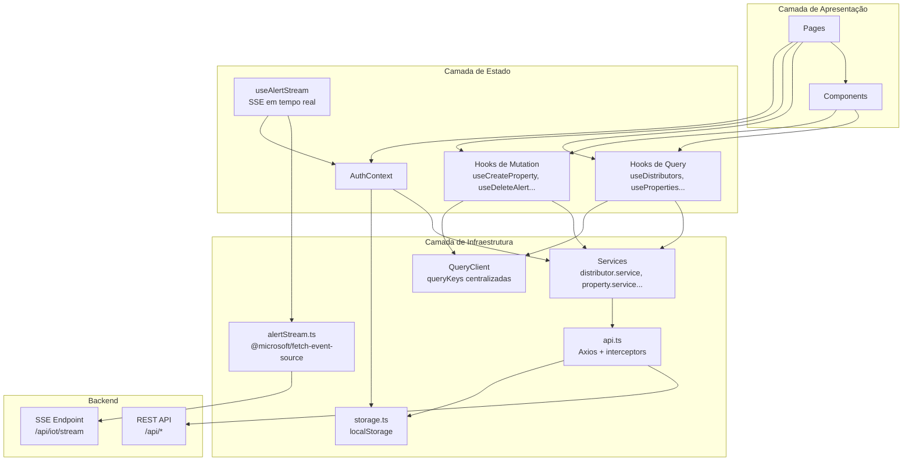

**Regras da arquitetura:**

- **Pages** orquestram dados e estado, delegando renderização para componentes.
- **Components** são apresentacionais e recebem dados via props ou hooks.
- **Hooks** encapsulam lógica de dados — nunca fazem fetch diretamente.
- **Services** são as únicas classes que chamam `api.ts` ou `storage`.
- **`api.ts`** é a única instância Axios; nunca instancie outra.

---

## Roteamento

### Mapa de Rotas

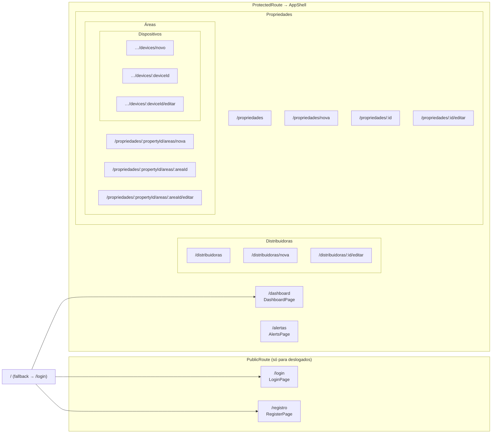

### Guardas de Rota

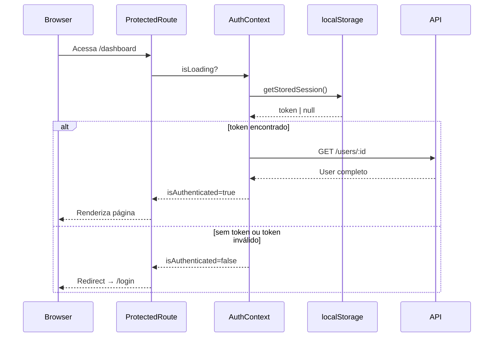

`PublicRoute` funciona de forma inversa: redireciona usuários **já autenticados** para `/dashboard` quando tentam acessar `/login` ou `/registro`.

---

## Autenticação

### Fluxo de Login

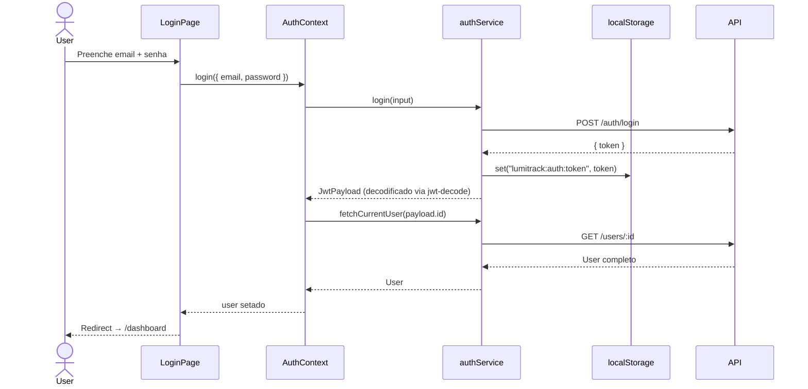

### Expiração e Revogação de Sessão

O interceptor de resposta do Axios monitora erros 401 e distingue dois casos:

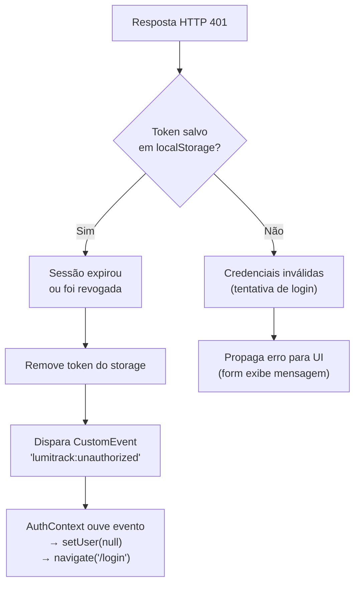

### Tipos de Usuário

O sistema suporta dois tipos de usuário com campos distintos:

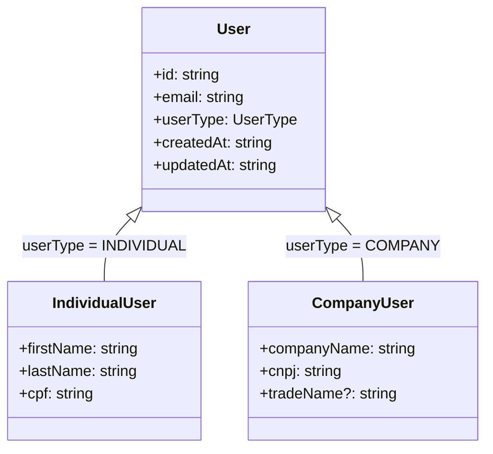

---

## Gerenciamento de Estado e Dados

### TanStack Query — Configuração Global

```typescript
// Defaults justificados em queryClient.ts
{
  staleTime: 30_000,          // 30s — dados "frescos", evita refetches em cascata
  gcTime: 5 * 60 * 1000,     // 5min — tempo em cache após componente desmontar
  retry: 1,                   // queries: 1 retentativa (falha transitória de rede)
  retry: 0,                   // mutations: NUNCA retentar (evita duplicatas)
  refetchOnWindowFocus: true  // refetch silencioso ao voltar para a aba
}
```

### Query Keys Centralizadas

Todas as chaves de cache são definidas em `src/lib/queryClient.ts` para evitar typos e facilitar invalidação cirúrgica:

```typescript
queryKeys = {
  distributors: {
    all, list(), detail(id)
  },
  properties: {
    all, list(), detail(id)
  },
  areas: {
    all, list(propertyId), detail(propertyId, areaId)
  },
  devices: {
    all, list(propertyId, areaId), detail(propertyId, areaId, deviceId)
  },
  consumption: {
    all, byProperty(propertyId, period?), byArea(...), byDevice(...)
  },
  alerts: {
    all, global(triggered?), byProperty(propertyId), byArea(...), byDevice(...)
  }
}
```

### Padrão de Invalidação após Mutations

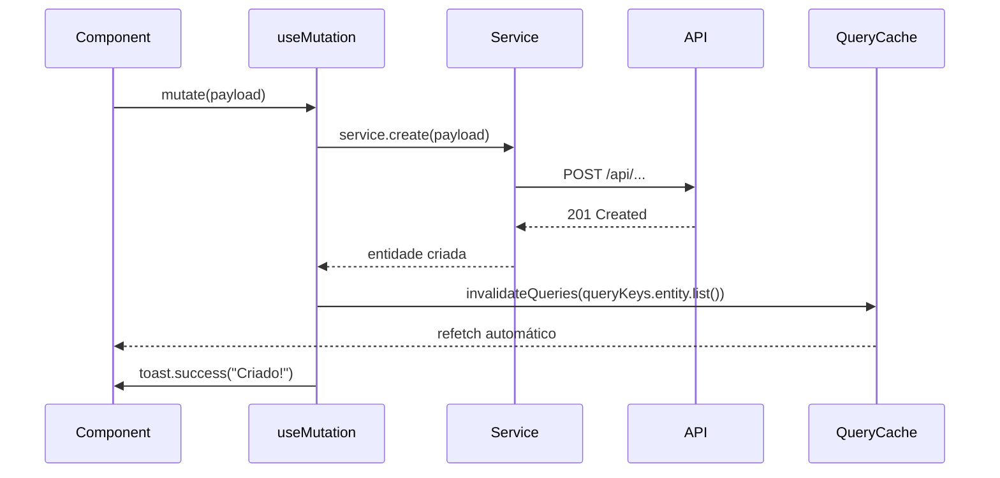

---

## Comunicação com o Backend

### Instância Axios (`src/services/api.ts`)

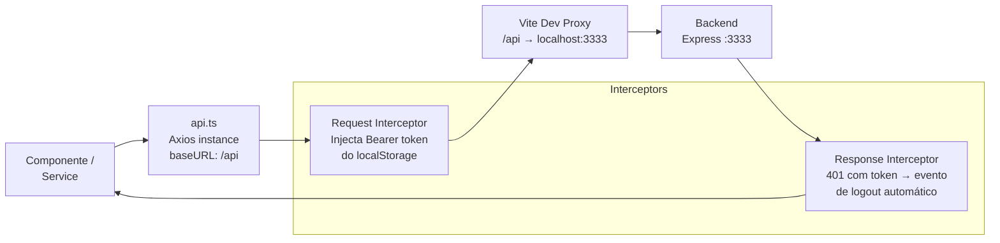

### Proxy de Desenvolvimento

O `vite.config.ts` redireciona todas as chamadas `/api/*` para `http://localhost:3333` durante o desenvolvimento, eliminando problemas de CORS:

```typescript
server: {
  port: 5173,
  proxy: {
    "/api": {
      target: "http://localhost:3333",
      changeOrigin: true,
    },
  },
},
```

### Envelope de Resposta da API

O backend retorna **sempre** o mesmo envelope:

```json
{ "status": "success", "data": <payload> }
{ "status": "error", "message": "<mensagem legível>" }
```

Os services extraem `response.data.data` diretamente, mantendo os hooks e componentes agnósticos ao formato de envelope.

---

## Alertas em Tempo Real (SSE)

### Arquitetura do Stream

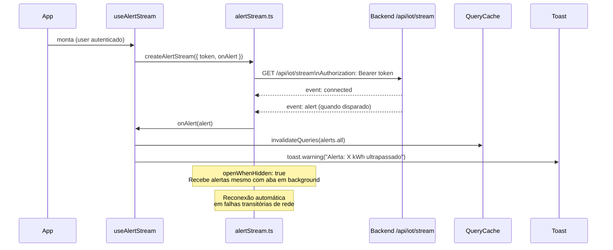

### Por que `@microsoft/fetch-event-source` e não `EventSource` nativo?

O `EventSource` nativo do browser **não suporta headers customizados** — limitação da especificação WHATWG. Isso inviabilizaria o envio do header `Authorization: Bearer <token>`. A alternativa de passar o token via query string (`?token=...`) expõe o JWT em logs de proxy/nginx, o que é uma má prática de segurança. A biblioteca usa `fetch()` internamente, resolvendo o problema.

### Eventos SSE Suportados

| Evento | Payload | Ação no frontend |
| --- | --- | --- |
| `connected` | `{ deviceCount: number }` | Ignorado (log interno) |
| `reading` | `{ deviceId, kwhConsumed }` | Ignorado (reservado para dashboard IoT) |
| `alert` | `Alert` completo | Invalida cache + toast de aviso |

---

## Hierarquia de Entidades

O modelo de dados segue uma hierarquia estrita refletida tanto nas rotas da API quanto na navegação do frontend:

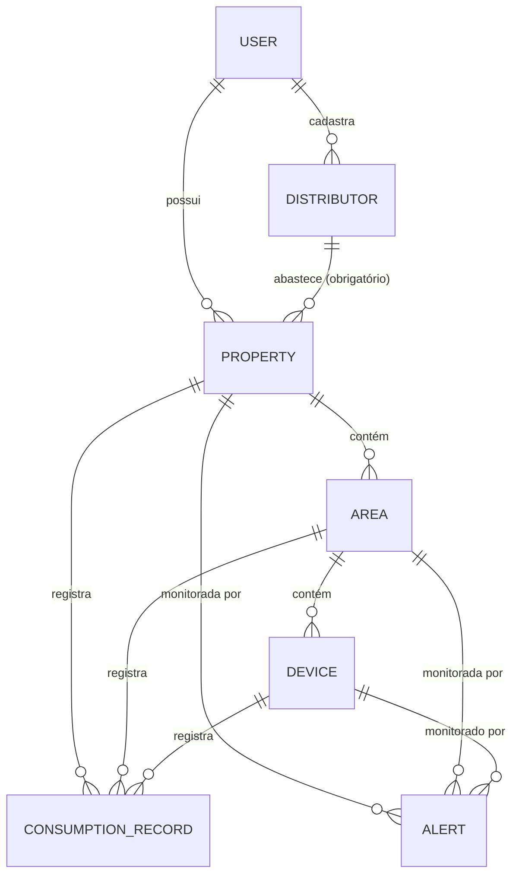

### Rotas da API

| Operação | Rota |
| --- | --- |
| Listar áreas de uma propriedade | `GET /api/properties/:propertyId/areas` |
| Listar dispositivos de uma área | `GET /api/properties/:propertyId/areas/:areaId/devices` |
| Consumo de um dispositivo | `GET /api/properties/:propertyId/areas/:areaId/devices/:deviceId/consumption` |
| Deletar registro de consumo | `DELETE /api/properties/:propertyId/consumption/:id` |

>[!IMPORTANT]
> O endpoint de delete de consumo sempre exige o `propertyId` raiz, mesmo quando o registro pertence a uma área ou dispositivo. Por isso, `ConsumptionRowMenu` recebe `propertyId` como prop separada do componente pai, que conhece o contexto correto.

---

## Layout e Componentes

### AppShell — Estrutura de Layout

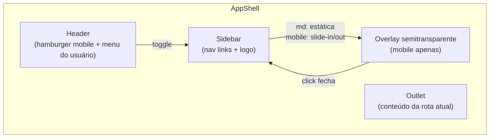

**Comportamento responsivo:**

- **Desktop (≥ md):** Sidebar estática à esquerda, sempre visível (`md:static md:translate-x-0`).
- **Mobile (< md):** Sidebar oculta por padrão (`-translate-x-full`). Hamburger no Header abre; overlay ou botão fechar fecha. Também fecha ao navegar de rota e ao pressionar `Escape`.

### Padrão de Componentes de Entidade

Cada entidade do sistema segue o mesmo padrão de componentes:

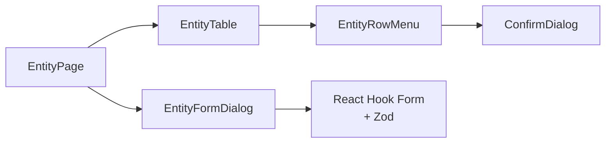

---

## Estratégia de Testes

### Pirâmide de Testes

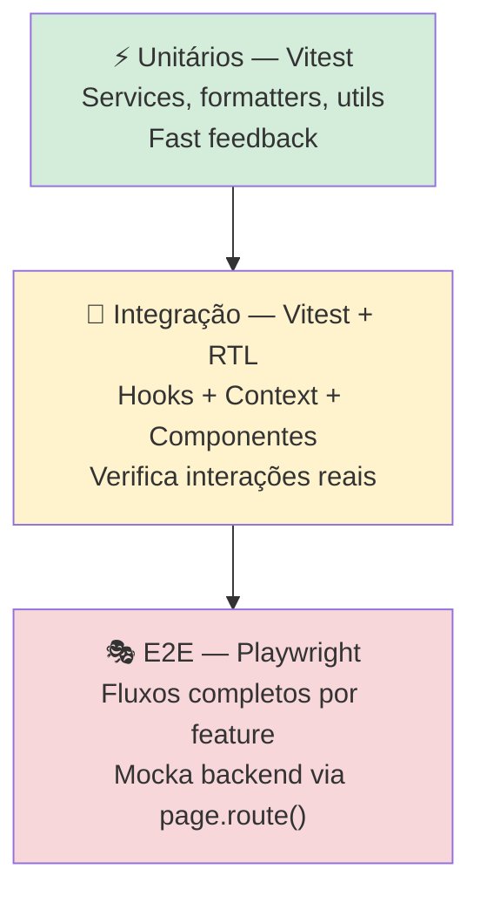

### Testes Unitários e de Integração (Vitest)

**Configuração (`vite.config.ts`):**

- Ambiente: `jsdom`
- Setup global: `src/tests/setup.ts` — mocka `window.matchMedia` e faz `cleanup()` após cada teste
- Cache isolado entre testes: `gcTime: 0` no `QueryClient` de teste

**Padrão de mock de services:**

```typescript
vi.mock("@/services/property.service", () => ({
  propertyService: {
    list: vi.fn(),
    getById: vi.fn(),
    // ...
  },
}))
```

### Testes E2E (Playwright)

Os testes E2E **não dependem do backend real**. Utilizam `page.route()` para interceptar todas as chamadas HTTP e responder com fixtures estáticas. Vantagens:

- Rodam no CI sem coordenação de infraestrutura
- Estado previsível e determinístico
- Cobertura dos fluxos completos de UI

**Padrão de setup:**

```typescript
// DB simulada como objeto mutável dentro do teste
const state = { properties: [], nextId: 1 }

await page.route("**/api/properties", async (route) => {
  if (route.request().method() === "GET")
    return fulfillJson(route, state.properties)
  if (route.request().method() === "POST") {
    // cria no estado e responde 201
  }
})
```

**Cobertura E2E atual:**

| Spec | Cenários cobertos |
| --- | --- |
| `auth.spec.ts` | Login sucesso, credenciais inválidas, logout, redirect |
| `properties.spec.ts` | CRUD completo, troca de distribuidora |
| `area.spec.ts` | CRUD completo, validação client-side |
| `device.spec.ts` | CRUD completo, menu contextual |
| `consumption.spec.ts` | CRUD, filtros de período, validações |
| `alert.spec.ts` | Inbox, filtros, marcar lido, CRUD |

---

## Scripts e Fluxo de Desenvolvimento

### Scripts disponíveis

```bash
# Desenvolvimento
npm run dev          # Sobe apenas o frontend (Vite :5173)
npm run dev:all      # Sobe backend (:3333) + frontend em paralelo (concurrently)

# Build
npm run build        # tsc + vite build (produção)
npm run preview      # Preview do build de produção

# Qualidade
npm run lint         # ESLint
npm run lint:fix     # ESLint com autocorreção
npm run format       # Prettier em src/**

# Testes
npm test             # Vitest (run único)
npm run test:watch   # Vitest em modo watch
npm run test:ui      # Vitest com interface gráfica
npm run test:coverage  # Relatório de cobertura (v8)
npm run test:e2e     # Playwright (headless)
npm run test:e2e:ui  # Playwright com interface gráfica
```

---
