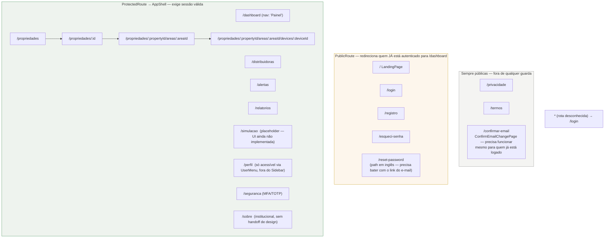
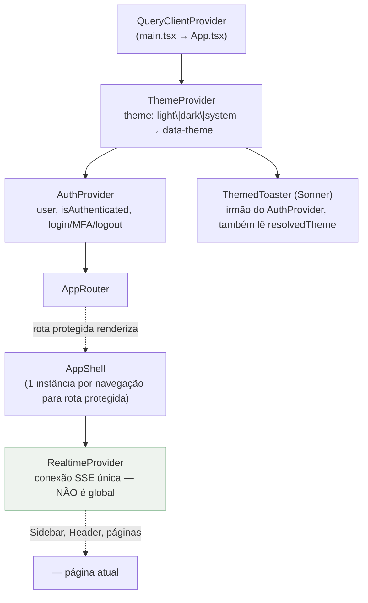
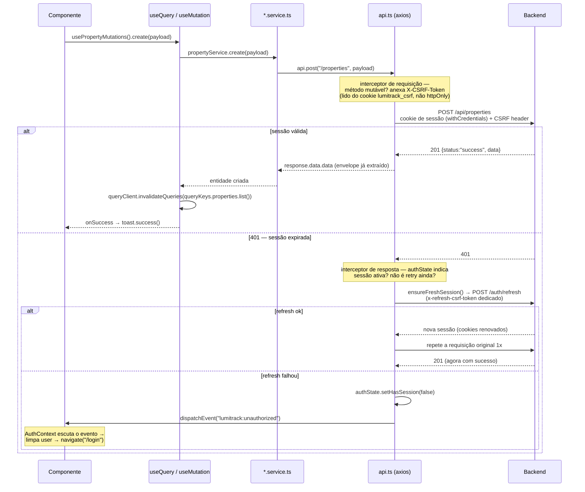
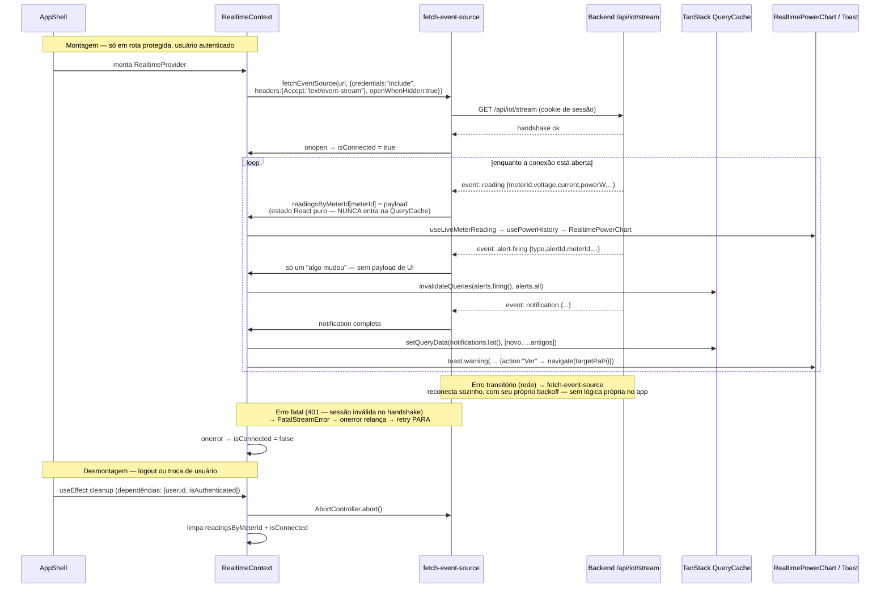

# ⚡ LumiTrack — Frontend

SPA React 19 + Vite 8 + TypeScript strict, consumindo a API do `backend/` e recebendo leituras/alertas em tempo real via SSE. Design system próprio (**Industry**), migração concluída nas Fases 1–7 do roadmap — todo o app usa os tokens e componentes do Industry, sem resíduo do tema anterior.

## Índice

- [Stack](#stack)
- [Estrutura de pastas](#estrutura-de-pastas)
- [Diagramas](#diagramas)
  - [Árvore de rotas com guardas de autenticação](#1-árvore-de-rotas-com-guardas-de-autenticação)
  - [Hierarquia de contexts](#2-hierarquia-de-contexts)
  - [Fluxo de dados, TanStack Query e API](#3-fluxo-de-dados-tanstack-query-e-api)
  - [Ciclo do SSE no cliente](#4-ciclo-do-sse-no-cliente)
- [Autenticação](#autenticação)
- [Tempo real (SSE)](#tempo-real-sse)
- [Design system (Industry)](#design-system-industry)
- [CSP e `index.html`](#csp-e-indexhtml)
- [Variáveis de ambiente](#variáveis-de-ambiente)
- [Como executar](#como-executar)
- [Scripts npm](#scripts-npm)
- [Testes](#testes)
- [Rotas e páginas](#rotas-e-páginas)

## Stack

| Camada | Tecnologia |
| --- | --- |
| UI | React 19, TypeScript strict |
| Build/dev server | Vite 8 |
| Roteamento | `react-router` 8 (pacote `react-router`, **não** `react-router-dom`) |
| Estado servidor | TanStack Query 5 |
| Estado local persistido | Context API (Auth, Theme, Realtime) + `localStorage` — sem Zustand/Redux |
| Formulários | React Hook Form 7 + `@hookform/resolvers` + Zod 4 (schemas compartilhados com o backend onde faz sentido) |
| Estilo | Tailwind CSS 4 (`@tailwindcss/vite`) + componentes próprios em `components/ui/` (Radix UI por baixo — `Dialog`, `Slot`) |
| Ícones | Lucide React |
| Gráficos | Recharts |
| Toasts | Sonner |
| HTTP | Axios (`withCredentials: true` — sessão via cookie, não Bearer) |
| Tempo real | `@microsoft/fetch-event-source` — SSE com cookie + header customizado, algo que o `EventSource` nativo não suporta |
| Markdown | `react-markdown` + `remark-gfm` (só a página "Sobre o projeto") |
| Testes | Vitest 4 + Testing Library 16 (unidade/integração), Playwright 1 (E2E) |

## Estrutura de pastas

```text
frontend/
├── public/
│   └── fonts/                    # Barlow + Barlow Condensed self-hospedadas (.woff2) —
│                                   # nenhuma requisição a fonts.googleapis.com em runtime
├── src/
│   ├── components/
│   │   ├── layout/                # AppShell, Sidebar, Header, UserMenu, NotificationDropdown, WarningBadge
│   │   ├── ui/                     # Blueprint, Button, Input, Select, Tag, ConfirmDialog, FormDialog,
│   │   │                           # Pagination, EmptyState, PasswordRequirements, ThemeToggle, GitHubIcon...
│   │   ├── dashboard/               # RealtimeSection, RealtimePowerChart, DashboardKpiRow
│   │   ├── meter/                    # MeterSection, MeterForm, MeterFormDialog
│   │   ├── auth/                      # MfaCodeForm
│   │   └── consumption/ · alert/       # componentes de tabela/formulário por domínio
│   ├── contexts/
│   │   ├── AuthContext.tsx             # sessão do usuário, login/MFA/logout
│   │   ├── ThemeContext.tsx            # light/dark/system, data-theme
│   │   └── RealtimeContext.tsx         # conexão SSE única, montada dentro de AppShell
│   ├── hooks/
│   │   ├── queries/                     # 1 arquivo de useQuery por domínio (ver "Rotas e páginas")
│   │   ├── useLiveMeterReading.ts        # lê RealtimeContext por meterId
│   │   ├── usePowerHistory.ts             # buffer local de leituras para o gráfico
│   │   ├── useLiveTicker.ts               # número ilustrativo animado (Login/Landing, sem sessão)
│   │   └── usePropertySelection.ts        # propriedade ativa, persistida em localStorage
│   ├── lib/
│   │   ├── queryClient.ts                  # instância + queryKeys centralizadas
│   │   ├── storage.ts                      # abstração sobre localStorage (theme, propriedade selecionada)
│   │   ├── csrf.ts                          # lê os cookies lumitrack_csrf / lumitrack_refresh_csrf
│   │   ├── authState.ts                     # flag em memória (hasSession) — cookie httpOnly é ilegível por JS
│   │   ├── sessionRefresh.ts                # refresh proativo aos 80% do TTL da sessão (~48min de 1h)
│   │   └── sse/appStream.ts                  # transporte SSE de baixo nível
│   ├── pages/
│   │   ├── landing/  auth/  dashboard/  property/  area/  device/
│   │   ├── distributor/  alert/  report/  simulation/  profile/  settings/
│   │   ├── legal/                            # LegalDocumentPage (base) + PrivacyPolicyPage, TermsOfUsePage
│   │   └── about/                             # AboutPage — /sobre, sem handoff de design (institucional)
│   ├── routes/
│   │   ├── AppRouter.tsx
│   │   ├── ProtectedRoute.tsx
│   │   └── PublicRoute.tsx
│   ├── services/                              # 1 arquivo por domínio, única camada que fala com api.ts
│   ├── config/
│   │   ├── navigation.ts                       # itens do Sidebar, nesta ordem
│   │   └── privacy.ts                          # lê VITE_PRIVACY_CONTACT_EMAIL
│   ├── styles/
│   │   ├── industry.css                        # tokens do design system (cor, tipografia, `data-theme`)
│   │   └── industry-fonts.css                  # @font-face das fontes self-hospedadas
│   ├── content/about.md                        # conteúdo da página "Sobre o projeto"
│   ├── tests/setup.ts
│   ├── App.tsx  ·  main.tsx  ·  index.css
├── tests/e2e/                                   # 13 specs Playwright
├── index.html                                    # CSP via <meta>, script anti-FOUC do tema
└── vite.config.ts
```

## Diagramas

### 1. Árvore de rotas com guardas de autenticação



Criação/edição de Propriedade, Área, Aparelho e Medidor acontece por **modal**, não por rota dedicada — decisão que substituiu rotas antigas do tipo `/propriedades/nova`. `ProtectedRoute` renderiza um placeholder de carregamento enquanto `AuthContext` ainda não resolveu a sessão (evita o flash de `/login` num refresh de página com sessão válida); só então decide navegar ou renderizar `<Outlet/>`. Não existe hoje nenhuma rota admin-only no roteador — a distinção é binária (autenticado ou não); o controle de papel (`ADMIN`) que existe no backend (`/api/admin/audit-logs`) não tem UI correspondente no frontend.

### 2. Hierarquia de contexts



`RealtimeProvider` fica de fora da árvore global de propósito: só existe enquanto uma rota protegida com `AppShell` está montada — em `/login` ou `/registro` não há conexão SSE aberta. Um comentário em `main.tsx` documenta um bug de performance já corrigido: havia um **segundo** `QueryClientProvider` (código morto, nunca efetivamente usado — o de `App.tsx` sempre vencia via contexto React) removido no achado M-11 da auditoria de qualidade.

### 3. Fluxo de dados, TanStack Query e API



Query keys centralizadas em `lib/queryClient.ts` — cada domínio (`properties`, `areas`, `devices`, `meters`, `alerts`, `notifications`, `tariffFlag`, ...) expõe `all`/`list(...)`/`detail(...)`, evitando string mágica espalhada pelos hooks. Refresh também dispara **proativamente** (não só reativo a 401): aos 80% do TTL da sessão (~48min de uma sessão de 1h — valor mantido manualmente em sincronia com `JWT_WEB_EXPIRES_IN` do backend, sem endpoint de descoberta).

### 4. Ciclo do SSE no cliente



`openWhenHidden: true` é deliberado: leituras e alertas continuam chegando com a aba em segundo plano, porque o badge "Dados ao vivo" e o badge de alerta disparado existem justamente para serem conferidos quando o usuário volta à aba. `isConnected` é um booleano derivado simples (sem estado intermediário de "reconectando") — nunca fica "preso" mostrando conectado quando o stream de fato caiu.

## Autenticação

Sessão **por cookie `HttpOnly`**, nunca por token em `localStorage` — o JWT em si nunca é lido nem manipulado pelo JavaScript do cliente (`api.ts` usa `withCredentials: true`, sem header `Authorization` jamais setado a partir de storage). `AuthContext` descobre se há sessão chamando `GET /api/auth/me` no boot; `isLoading` só vira `false` depois dessa resposta.

**Login em duas etapas quando MFA está habilitado**: `POST /auth/login` retorna `{mfaRequired:true, mfaToken}` sem nunca estabelecer sessão; `LoginPage` troca o formulário de credenciais por `MfaCodeForm`, que envia `POST /auth/login/mfa {mfaToken, code}` — só aí a sessão de fato é criada. O mesmo padrão vale para `demoLogin` (gated por `VITE_DEMO_MODE` no cliente e `DEMO_LOGIN_ENABLED` no backend).

**CSRF (double-submit)**: dois cookies não-`httpOnly` — `lumitrack_csrf` (sessão) e `lumitrack_refresh_csrf` (dedicado ao endpoint de refresh, TTL mais longo) — lidos direto de `document.cookie` (`lib/csrf.ts`) e anexados como header em toda requisição de método mutável (`POST`/`PUT`/`PATCH`/`DELETE`).

`/seguranca` cobre o ciclo completo de MFA: setup (QR code + 10 backup codes mostrados uma única vez), verificação e desabilitação (exige senha **e** código válido — nunca só um dos dois).

## Tempo real (SSE)

| Evento | Payload | Efeito no cliente |
| --- | --- | --- |
| `connected` | `{ meterCount }` | Recebido, sem handler específico hoje |
| `reading` | `{ meterId, voltage, current, powerW, powerFactor, receivedAt }` | Guardado em estado React puro (`RealtimeContext`), nunca na QueryCache — chega a ~1/s por medidor, não cabe no modelo de cache de query |
| `alert-firing` | `{ type: "start"\|"end", alertId, alertName, meterId, startedAt, endedAt? }` | Só invalida as queries de alerta — não carrega estado de UI, é reconsultado via REST |
| `notification` | `Notification` completa | Escrita direta na QueryCache (`setQueryData`, sem refetch) + toast com ação "Ver" |

Uso de `@microsoft/fetch-event-source` em vez do `EventSource` nativo: o nativo não suporta credenciais/headers customizados exigidos aqui (`credentials: "include"` para o cookie de sessão) — limitação da própria especificação WHATWG, não escolha de biblioteca por conveniência.

## Design system (Industry)

Migração **concluída nas Fases 1–7** do roadmap: fundação de tokens, componentes base, todas as telas existentes, o chrome do app autenticado (Sidebar/Header) e a consistência das telas públicas. Nenhuma tela usa mais o tema anterior (`.dark` como classe, cores âmbar/slate).

- **Dark mode** via atributo `data-theme` em `<html>` (`ThemeContext`, não mais classe CSS) — `light`, `dark` ou `system` (resolvido por `prefers-color-scheme`). O `index.html` tem um script anti-FOUC inline que replica a mesma resolução **antes** do React montar, para não piscar claro antes de aplicar o tema escuro; o conteúdo exato desse script é travado por um hash SHA-256 na CSP (ver abaixo) — mudar o script exige recalcular o hash.
- **Fontes self-hospedadas** — Barlow e Barlow Condensed, 10 arquivos `.woff2` em `public/fonts/`, nenhuma requisição a `fonts.googleapis.com` em runtime.
- **`Blueprint`** é o componente-assinatura do Industry: moldura com marcas de canto (`<i className="corner tl/tr/bl/br">`), usado de forma pervasiva nas telas.
- Dívida conhecida, não escondida (Fase 18 do roadmap): o `@theme` do Tailwind mapeia cor/fonte/raio/sombra, mas não a escala tipográfica/espaçamento real do protótipo — por isso ~143 valores arbitrários entre colchetes ainda aparecem pelo código.

## CSP e `index.html`

```text
default-src 'self';
script-src 'self' 'sha256-+up+7C+rtXMLX83AFmz9GUqo6C3J6ptqB1rNLtcKJRM=';
style-src 'self' 'unsafe-inline';
img-src 'self' data:;
connect-src 'self';
frame-ancestors 'none';
base-uri 'none';
object-src 'none';
```

O único `<script>` inline (o anti-FOUC do tema) é liberado por **hash**, não por `'unsafe-inline'` — o Vite não transforma script inline não-module durante o build, então o hash é estável entre `index.html` e `dist/index.html`. Um comentário no próprio arquivo documenta o comando para recalcular o hash se o script mudar.

**Nota técnica preservada do arquivo**: `frame-ancestors`, `base-uri` e `object-src` **não têm efeito via `<meta>`** — só via header HTTP. Ficam documentados aqui como intenção; o reverse proxy de produção (ADR-0008) precisa enviar o header `Content-Security-Policy` equivalente incluindo essas três diretivas para valerem de fato.

## Variáveis de ambiente

| Variável | Exemplo (`.env.example`) | Usada no código? |
| --- | --- | --- |
| `VITE_DEMO_MODE` | `false` | **Sim** — `LoginPage` mostra os botões de login de demonstração só quando `"true"` |
| `VITE_PRIVACY_CONTACT_EMAIL` | `privacidade@seu-dominio.com.br` | **Sim** — `config/privacy.ts`, exibido no rodapé/política de privacidade. Placeholder de portfólio — trocar antes de qualquer uso com titular real |
| `VITE_API_BASE_URL` | `http://localhost:3000` | **Não.** Declarada no `.env.example`, mas a base real da API é `"/api"` hardcoded em `services/api.ts` (depende do proxy do Vite/reverse proxy same-origin) |
| `VITE_SSE_URL` | `http://localhost:3000/iot/stream` | **Não.** O endpoint real é `"/api/iot/stream"` hardcoded em `lib/sse/appStream.ts` |

As duas últimas ficam registradas aqui porque **existem no `.env.example`**, mas documentá-las como configuração viva seria falso — nenhuma delas é lida em lugar nenhum do código hoje.

## Como executar

```bash
cd frontend
npm install
cp .env.example .env      # ajuste VITE_DEMO_MODE / VITE_PRIVACY_CONTACT_EMAIL se necessário

npm run dev                # Vite :5173, proxy /api → http://localhost:3333
# ou, com o backend junto:
npm run dev:all            # backend (:3333) + frontend (:5173) via concurrently
```

Pré-requisito: o backend precisa estar rodando (`../backend`, ver `backend/README.md`) para qualquer chamada de API funcionar — o frontend não tem modo mock embutido fora dos testes E2E.

## Scripts npm

```text
dev            → vite
dev:all        → concurrently backend (npm run dev) + frontend (npm run dev)
build          → tsc -b && vite build
preview        → vite preview
lint           → eslint .
lint:fix       → eslint . --fix
format         → prettier --write "src/**/*.{ts,tsx,css,json}"
format:check   → prettier --check "src/**/*.{ts,tsx,css,json}"
test           → vitest run
test:watch     → vitest
test:ui        → vitest --ui
test:coverage  → vitest run --coverage
test:e2e       → playwright test
test:e2e:ui    → playwright test --ui
```

## Testes

| Tipo | Ferramenta | Quantidade |
| --- | --- | --- |
| Unidade + integração | Vitest 4 + Testing Library 16 (jsdom) | 71 arquivos `*.test.ts(x)` |
| E2E | Playwright 1 | 13 specs em `tests/e2e/` |

Config do Vitest (`vite.config.ts`, bloco `test`): `environment: "jsdom"`, `setupFiles: "./src/tests/setup.ts"`, exclui `tests/e2e/**`. O setup global mocka `window.matchMedia` (jsdom não implementa — necessário para `ThemeContext` resolver `prefers-color-scheme`), roda `cleanup()` da Testing Library após cada teste e limpa `localStorage` entre testes (evita vazar tema persistido de um teste para o outro).

Specs E2E (Playwright, mockam o backend via `page.route()` — não dependem de backend real rodando): `auth`, `landing`, `dashboard`, `distributors`, `properties`, `area`, `device`, `meter`, `consumption`, `alerts`, `realtime`, `reports`, `profile`.

## Rotas e páginas

| Rota | Página | Guarda |
| --- | --- | --- |
| `/` | Landing | `PublicRoute` |
| `/login` | Login (com MFA em 2 etapas e login de demonstração) | `PublicRoute` |
| `/registro` | Cadastro | `PublicRoute` |
| `/esqueci-senha` | Recuperar senha | `PublicRoute` |
| `/reset-password` | Redefinir senha (path em inglês — casa com o link do e-mail) | `PublicRoute` |
| `/confirmar-email` | Confirmação de troca de e-mail (issue #178) | público, fora de qualquer guarda |
| `/privacidade`, `/termos` | Documentos legais | público, fora de qualquer guarda |
| `/dashboard` | Painel — KPIs + `RealtimeSection` com gráfico de potência ao vivo | `ProtectedRoute` |
| `/propriedades`, `/propriedades/:id` | Propriedades (CRUD via modal + detalhe com Áreas/Medidor) | `ProtectedRoute` |
| `/propriedades/:propertyId/areas/:areaId` | Detalhe de Área (CRUD de Aparelhos via modal) | `ProtectedRoute` |
| `/propriedades/:propertyId/areas/:areaId/devices/:deviceId` | Detalhe de Aparelho (Medidor vinculado via modal) | `ProtectedRoute` |
| `/distribuidoras` | Distribuidoras (catálogo) | `ProtectedRoute` |
| `/alertas` | Alertas — CRUD + episódios disparados | `ProtectedRoute` |
| `/relatorios` | Relatórios — seletor em cascata Propriedade→Área→Aparelho, 4 granularidades | `ProtectedRoute` |
| `/simulacao` | Simulação — **placeholder**, UI ainda não implementada (backend já pronto) | `ProtectedRoute` |
| `/perfil` | Perfil — dados pessoais, direitos LGPD (export/exclusão), só acessível via menu do usuário | `ProtectedRoute` |
| `/seguranca` | MFA — setup, verificação, backup codes, desabilitar | `ProtectedRoute` |
| `/sobre` | Sobre o projeto — institucional, sem handoff de design, renderiza `content/about.md` | `ProtectedRoute` |

Não existe rota/página dedicada a Medidores fora do contexto de Propriedade/Área/Aparelho, nem UI para exportação DSAR além de um link direto em `/perfil` (`<a href="/api/users/me/data-export?format=json" download>`), nem UI para a trilha de auditoria (`/api/admin/audit-logs` do backend não tem tela correspondente).
