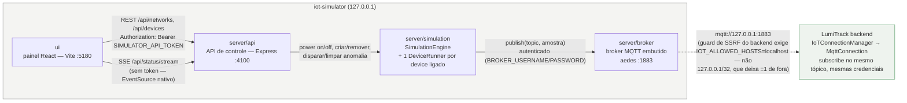
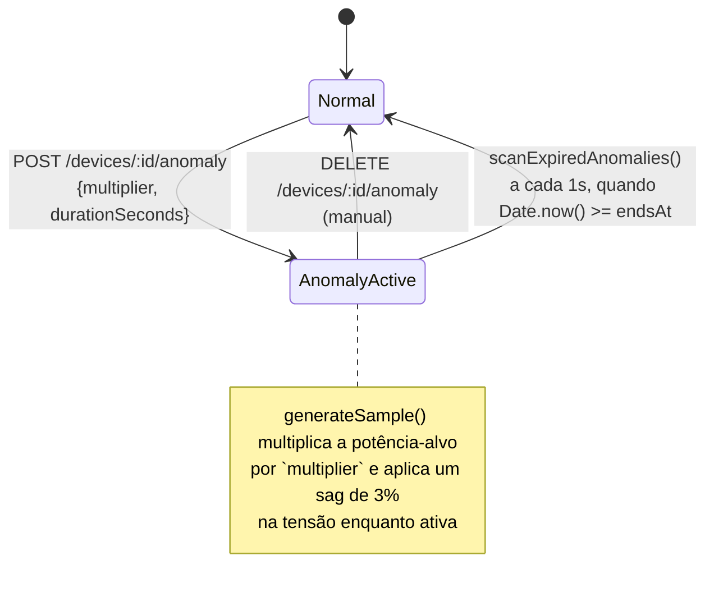
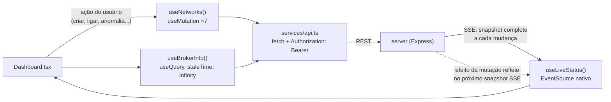
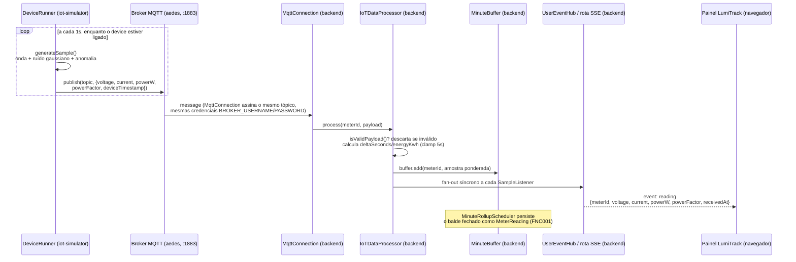

# iot-simulator

Ferramenta standalone que finge ser uma rede de medidores IoT reais publicando via MQTT — para exercitar o pipeline de ingestão do LumiTrack (`backend/`) ponta a ponta, com dado vivo, sem hardware físico. Broker MQTT embutido (via `aedes`): não depende de nenhum broker externo, nenhuma conta em nuvem, nenhum dispositivo real.

É um workspace npm com dois pacotes independentes:

| Pacote | O que é | Porta padrão |
|---|---|---|
| [`server/`](server/) | API de controle + broker MQTT embutido + motor de simulação | API `4100` · MQTT `1883` |
| [`ui/`](ui/) | Painel React para criar redes, ligar/desligar medidores virtuais e injetar anomalias | `5180` |

> **Ferramenta de desenvolvimento e demonstração local.** Ambos os processos escutam por padrão só em `127.0.0.1` — nunca exponha este pacote publicamente (issue [#180](https://github.com/viniciussartini/lumitrack/issues/180)). Ele existe para dar vida à demo do LumiTrack (Painel em tempo real, alertas disparando), não para ser um produto à parte.

## Índice

- [Arquitetura](#arquitetura)
- [Como rodar](#como-rodar)
- [`server` — API de controle e broker MQTT](#server--api-de-controle-e-broker-mqtt)
- [`ui` — painel de controle](#ui--painel-de-controle)
- [Fluxo ponta a ponta: da publicação ao painel do LumiTrack](#fluxo-ponta-a-ponta-da-publicação-ao-painel-do-lumitrack)
- [Como plugar no backend real do LumiTrack](#como-plugar-no-backend-real-do-lumitrack)
- [Testes e CI](#testes-e-ci)
- [Solução de problemas](#solução-de-problemas)
- [Referências](#referências)

## Arquitetura

### Topologia



O simulador não fala com o backend diretamente — os dois só se encontram **dentro do broker MQTT**: o simulador publica, o backend assina o mesmo tópico com as mesmas credenciais. Do ponto de vista do backend, o simulador é indistinguível de um medidor MQTT real.

### Pacotes do monorepo

```text
iot-simulator/
├── package.json          # workspace root: só o script "dev" (concurrently server+ui)
├── server/                # ver detalhamento em "server — API de controle e broker MQTT"
│   ├── src/
│   │   ├── api/           # Express: app.ts, routes/, middlewares/, schemas.ts (Zod)
│   │   ├── broker/        # broker.ts — wrapper do aedes (autenticação, start/stop)
│   │   ├── mqtt/          # internalPublisher.ts — cliente MQTT que a simulação usa p/ publicar
│   │   ├── simulation/    # store.ts, simulationEngine.ts, deviceRunner.ts, signalGenerator.ts, types.ts
│   │   ├── config/env.ts  # validação Zod das env vars, fail-closed
│   │   ├── shared/        # logger (pino), rateLimiter, errors
│   │   └── index.ts       # boot: broker → publisher → store/engine → API HTTP → shutdown gracioso
│   └── README.md          # guia rápido específico do server (referenciado, não duplicado aqui)
└── ui/                     # ver detalhamento em "ui — painel de controle"
    └── src/
        ├── components/     # device/ (DeviceCard, DeviceControls, AnomalyButton...), network/, ui/ (Industry)
        ├── hooks/          # useNetworks (mutations), useLiveStatus (SSE), useBrokerInfo (query)
        ├── pages/Dashboard.tsx
        ├── services/api.ts # cliente REST fino, anexa Bearer
        └── types.ts        # espelha server/src/simulation/types.ts (apps separados, sem import compartilhado)
```

## Como rodar

### Pré-requisitos

- Node.js 24 (mesma versão do backend real).
- Nenhum banco de dados, nenhum broker externo — tudo roda em processo.

### Setup

```bash
cd iot-simulator
npm install                     # instala os dois workspaces (server + ui)

cp server/.env.example server/.env
cp ui/.env.example ui/.env
```

Edite os dois `.env` recém-criados:

- Em `server/.env`, defina `SIMULATOR_API_TOKEN` (mínimo 16 caracteres), `BROKER_USERNAME` e `BROKER_PASSWORD` — as três são **obrigatórias, sem default** (fail-closed, issue [#180](https://github.com/viniciussartini/lumitrack/issues/180)). O servidor recusa subir sem elas.
- Em `ui/.env`, `VITE_SIMULATOR_API_TOKEN` precisa ser **exatamente o mesmo valor** de `SIMULATOR_API_TOKEN` do server — a UI anexa esse token em toda chamada à API de controle.

### Rodando os dois juntos

Da raiz do pacote (`iot-simulator/`):

```bash
npm run dev
```

Isso sobe, via `concurrently` (com `--kill-others-on-fail`, então se um cair o outro também para):

- **API de controle** em `http://127.0.0.1:4100`
- **Broker MQTT embutido** em `mqtt://127.0.0.1:1883`
- **Painel** em `http://localhost:5180` (o Vite faz proxy de `/api` para a porta 4100 — ver `ui/vite.config.ts`)

Abra `http://localhost:5180` — o painel mostra o indicador "conectado" (via SSE) assim que a API responde.

### Rodando cada pacote isoladamente

```bash
npm run dev -w server     # só a API + broker
npm run dev -w ui         # só o painel (precisa do server rodando à parte para funcionar de verdade)
```

## `server` — API de controle e broker MQTT

### Variáveis de ambiente

| Variável | Default | Obrigatória | Descrição |
|---|---|---|---|
| `NODE_ENV` | `development` | Não | `development` \| `production` \| `test` |
| `BROKER_PORT` | `1883` | Não | Porta do broker MQTT embutido |
| `BROKER_HOST` | `127.0.0.1` | Não | Bind do broker — **não altere fora de uma máquina de demonstração isolada** |
| `API_PORT` | `4100` | Não | Porta da API de controle |
| `API_HOST` | `127.0.0.1` | Não | Bind da API — mesma ressalva do `BROKER_HOST` |
| `CORS_ORIGIN` | `http://localhost:5180` | Não | Origem permitida (o painel `ui`) |
| `LOG_LEVEL` | `info` | Não | Nível do pino: `fatal`\|`error`\|`warn`\|`info`\|`debug`\|`trace`\|`silent` |
| `SIMULATOR_API_TOKEN` | — | **Sim** (mín. 16 caracteres) | Protege `/api/networks` e `/api/devices` via `Authorization: Bearer` |
| `BROKER_USERNAME` | — | **Sim** | Credencial exigida pelo broker embutido de **todo** cliente MQTT |
| `BROKER_PASSWORD` | — | **Sim** | Idem |

Validação em `src/config/env.ts` via Zod, `safeParse` sobre `process.env` — falha ausente/inválida imprime o erro e `process.exit(1)` antes de qualquer coisa subir (fail-closed, mesma convenção do `backend/src/config/env.ts`).

### Endpoints

| Método | Rota | Autenticação | Corpo | Descrição |
|---|---|---|---|---|
| `GET` | `/health` | — | — | `{ status: "ok" }` |
| `GET` | `/api/broker/info` | — | — | `{ host, port }` do broker — informação já pública por design |
| `GET` | `/api/status/stream` | — | — | SSE: reenvia o **snapshot completo** de todas as redes a cada mudança |
| `GET` | `/api/networks` | Bearer | — | Snapshot de todas as redes e seus devices |
| `POST` | `/api/networks` | Bearer | `{ name }` | Cria uma rede vazia — `201` |
| `DELETE` | `/api/networks/:id` | Bearer | — | Remove a rede e para todos os `DeviceRunner` dos seus devices — `204` |
| `GET` | `/api/networks/:id/devices` | Bearer | — | Lista os devices da rede |
| `POST` | `/api/networks/:id/devices` | Bearer | `{ name, topic, params? }` | Cria um device (desligado) — `201` |
| `PATCH` | `/api/devices/:id` | Bearer | `{ name?, topic?, params? }` | Atualiza campos do device |
| `DELETE` | `/api/devices/:id` | Bearer | — | Remove o device e para seu `DeviceRunner` — `204` |
| `POST` | `/api/devices/:id/power` | Bearer | `{ on: boolean }` | Liga/desliga — ligar inicia o `DeviceRunner` (publica ~1×/s) |
| `POST` | `/api/devices/:id/anomaly` | Bearer | `{ multiplier?, durationSeconds? }` (default `3`, `30`) | Injeta um pico de potência temporário |
| `DELETE` | `/api/devices/:id/anomaly` | Bearer | — | Cancela a anomalia ativa antes do prazo |

`/api/broker/info` e `/api/status/stream` ficam **sem token** deliberadamente: o primeiro só expõe host/porta já públicos por design; o segundo é consumido via `EventSource` nativo do browser, que não permite headers customizados — a alternativa seria token na query string, um vazamento pior (fica em log de acesso) para um endpoint só de leitura.

Erros seguem o formato `{ status: "error", message, issues? }` — `422` para corpo inválido (Zod), `404` para rede/device inexistente, `401` para token ausente/incorreto, `500` para o resto. Express 5 encaminha automaticamente exceções síncronas e rejeições de handler assíncrono para o middleware de erro central — nenhuma rota precisa de `try/catch` manual.

### Segurança e perímetro

Endurecido na issue [#180](https://github.com/viniciussartini/lumitrack/issues/180), que fechou o achado `[MÉDIA]` do laudo de segurança "`iot-simulator` exposto sem autenticação, sem helmet e sem rate limit; broker MQTT anônimo em `0.0.0.0`" e é um dos gates de go-live da [ADR-0008](../.claude/docs/adr/0008-hospedagem-brasil-oracle-always-free.md).

- **Token de API** (`SIMULATOR_API_TOKEN`) — comparação em **tempo constante** (`timingSafeEqual`, `src/api/middlewares/apiToken.ts`), mesmo padrão do `backend/src/shared/security/csrf.ts`.
- **Autenticação MQTT obrigatória** — o hook `authenticate` do `aedes` (`src/broker/broker.ts`) recusa qualquer cliente sem `BROKER_USERNAME`/`BROKER_PASSWORD` corretos (também comparação em tempo constante), incluindo o **publisher interno da própria simulação**. Antes da #180 o broker aceitava qualquer cliente anônimo.
- **Sem ACL por tópico** — quem passa pela autenticação pode publicar em qualquer tópico. Decisão deliberada de YAGNI (`.claude/project_context/06-code-quality-standards.md`): há um único broker embutido e um único consumidor de confiança (o backend real); desenhar permissão por tópico sem um segundo consumidor seria complexidade sem necessidade real.
- **Bind em `127.0.0.1`** por padrão, tanto na API quanto no broker — **nunca altere isso fora de uma máquina de demonstração isolada**.
- **Rate limit** — 300 requisições / 15 min por IP (`src/shared/rateLimiter.ts`), desligado só em `NODE_ENV=test`. Fixo (não configurável por env como no backend real): é ferramenta de dev local com um único operador, não precisa da tunabilidade de um serviço multi-tenant exposto.
- **helmet com CSP restritiva** — `default-src 'none'`, `frame-ancestors 'none'`: a API é JSON+SSE pura, nunca serve HTML sob essa origem, mesma postura do `backend/src/app.ts`.
- **CORS restrito** a `CORS_ORIGIN` (o painel).

### Modelo de simulação

#### Estado (`SimulationStore`)

Tudo em memória, num único processo — **reiniciar o servidor zera tudo** (aceitável: é ferramenta de dev, sem estado que precise sobreviver a um restart). `SimulationStore extends EventEmitter`: toda mutação (`createNetwork`, `createDevice`, `setPower`, `setAnomaly`, ...) emite um evento `"changed"` que a rota SSE (`/api/status/stream`) escuta para empurrar um snapshot novo ao painel — não há polling em lugar nenhum do sistema. `recordSample` é exceção: como é chamado em rajada (1x/s por device ligado), suas notificações são coalescidas (`setImmediate`) numa única `"changed"` por rajada, em vez de uma por device.

```ts
VirtualNetwork { id, name, devices: Map<string, VirtualDevice> }

VirtualDevice {
  id, networkId, name, topic, poweredOn,
  params: DeviceParams,       // ver abaixo
  anomaly: AnomalyState,      // ver abaixo
  lastSample: ElectricalSample | null,
  lastPublishedAt: number | null,  // epoch ms
  publishCount: number,
  connected: boolean,          // true assim que a 1ª amostra é publicada
}

DeviceParams {
  nominalVoltage: number        // V — default 220
  nominalPowerW: number         // W — default 1000
  powerFactorBase: number       // 0–1 — default 0.95
  noiseAmplitudePercent: number // 0–100 — default 1
  profile: "RESIDENTIAL_STEADY" | "COMMERCIAL_HVAC" | "INDUSTRIAL_MOTOR" | "CUSTOM"
}
```

> `profile` é hoje **só um rótulo informativo** na UI (`PROFILE_LABELS` em `NetworkCard.tsx`/`DeviceControls.tsx`) — o gerador de sinal (abaixo) usa apenas os 4 parâmetros numéricos, o valor de `profile` não altera a forma da onda gerada. Diferenciar o comportamento elétrico por perfil é uma extensão possível, não implementada.

#### Motor (`SimulationEngine` + `DeviceRunner`)

Um `DeviceRunner` por device **ligado**: `setInterval` de 1 s que gera uma amostra, publica no broker (via `InternalPublisher`) e grava o resultado no store. Se o device for removido ou desligado por fora (ex.: outra aba, outra chamada de API) entre um tick e outro, o próprio runner se autodetecta e para (`stop()` defensivo) — não depende de quem desligou também limpar o runner.

O `SimulationEngine` orquestra os runners (map `deviceId → DeviceRunner`) e roda um scanner próprio (`ANOMALY_SCAN_INTERVAL_MS = 1000`) que expira anomalias por tempo automaticamente — quem chamou `POST /devices/:id/anomaly` não precisa lembrar de limpar.



#### Gerador de sinal elétrico (`signalGenerator.ts`)

Sem dependência externa — ruído gaussiano via **transformação de Box-Muller** implementada à mão. Para cada tick:

1. **Onda de fundo:** seno de período ~300 ticks (5 min a 1 amostra/s) e amplitude 5% sobre `nominalPowerW` — dá variação orgânica mesmo sem anomalia.
2. **Ruído:** gaussiano proporcional a `nominalPowerW × (noiseAmplitudePercent / 100)`.
3. **Anomalia** (se ativa): multiplica a potência-alvo por `multiplier` e aplica um sag de 3% na tensão.
4. **Clamps de segurança:** `voltage ≥ 1` e `powerFactor ≥ 0.01` — sem eles, ruído gaussiano ocasional levaria um dos dois a ~0, e `current = powerW / (voltage × powerFactor)` viraria `Infinity`/`NaN`. O backend real descartaria esse payload silenciosamente (`IoTDataProcessor.isValidPayload`), com o sintoma confuso de "simulador rodando, mas o backend não recebe nada".
5. **Corrente derivada:** `current = powerW / (voltage × powerFactor)` — nunca gerada independentemente, para manter as três grandezas eletricamente coerentes entre si.

### Boot e shutdown

`src/index.ts` inicializa nesta ordem: broker → publisher interno (conecta nele mesmo) → store + engine → API HTTP. No `SIGTERM`/`SIGINT`, a ordem se inverte — engine para (todos os `DeviceRunner`), publisher desconecta, servidor HTTP fecha, broker fecha — e só então `process.exit(0)`. Um `shuttingDown` flag evita rodar o desligamento duas vezes se os dois sinais chegarem próximos.

## `ui` — painel de controle

### Variáveis de ambiente

| Variável | Descrição |
|---|---|
| `VITE_SIMULATOR_API_TOKEN` | Precisa bater com `SIMULATOR_API_TOKEN` do `server/.env` — anexado como `Authorization: Bearer` em toda chamada |

### Stack

React 19 + Vite 8 + TanStack Query + Tailwind 4, reaproveitando os **tokens de design Industry** do frontend principal (`src/styles/industry.css`, `industry-fonts.css` — mesmas fontes Barlow self-hospedadas, sem request externo a `fonts.googleapis.com`). Componentes de UI (`Button`, `Input`, `Select`, `Modal`, `Blueprint`, `CopyButton`) são cópias locais e enxutas dos primitivos do frontend principal — os dois apps não compartilham import (workspaces separados, sem pacote comum), duplicação deliberada para manter o simulador como app standalone de verdade.

Em dev, o Vite faz proxy de `/api/*` para `http://localhost:4100` (`vite.config.ts`) — mesmo padrão do frontend principal apontando para o backend real, evita configurar CORS explícito em desenvolvimento.

### Fluxo de dados

Duas fontes bem separadas, de propósito:

- **Leitura** (redes, devices, status de conexão) vem **inteiramente do SSE** (`useLiveStatus`, consumindo `/api/status/stream` via `EventSource` nativo). O servidor reenvia o snapshot completo a cada mudança — não há merge/diff local nem polling.
- **Escrita** (criar rede, ligar device, injetar anomalia, ...) são `useMutation` do TanStack Query, sem `useQuery`/cache associado (`useNetworks.ts`). Como o servidor já reenvia o snapshot atualizado pelo SSE logo após qualquer mutação surtir efeito, duplicar esse estado numa query seria uma segunda fonte de verdade desnecessária.
- A única `useQuery` de fato é `useBrokerInfo` (`staleTime: Infinity`) — `host:port` do broker não muda em runtime.



### Estrutura de componentes

- **`Dashboard.tsx`** — topbar (endereço do broker + indicador conectado/desconectado), 3 cards de estatística (redes, dispositivos, publicando), botão "Criar rede" e a lista de `NetworkCard`.
- **`NetworkCard.tsx`** — `<details>` colapsável por rede; botão remover rede; lista de `DeviceCard`; modal "Adicionar dispositivo" (nome, tópico MQTT, `DeviceParamsFields` + `Select` de perfil).
- **`DeviceCard.tsx`** — nome, tópico (com botão copiar), indicador "publicando — há Xs" (`useTick` local re-renderiza 1×/s só para esse contador, sem esperar o próximo evento SSE), botão ligar/desligar, `DeviceControls` (editar parâmetros inline) e `AnomalyButton`.
- **`AnomalyButton.tsx`** — sem anomalia ativa: campos multiplicador/duração + botão "Injetar anomalia". Com anomalia ativa: contagem regressiva até `endsAt` + botão "Cancelar".
- **`DeviceParamsFields.tsx`** — os 4 campos numéricos (tensão, potência, fator de potência, ruído), compartilhados entre o modal de criação e `DeviceControls`.

## Fluxo ponta a ponta: da publicação ao painel do LumiTrack

Do tick do `DeviceRunner` até a leitura aparecer no Painel do LumiTrack via SSE — atravessando os dois processos (simulador e backend real):



O `deviceTimestamp` que o simulador envia é só diagnóstico — o backend sempre usa `receivedAt = new Date()` do próprio servidor como timestamp de verdade, para que o relógio do simulador nunca possa divergir do relógio que decide agregação por minuto.

## Como plugar no backend real do LumiTrack

1. **Configure e suba o simulador** (seção "Como rodar" acima). Anote `SIMULATOR_API_TOKEN`, `BROKER_USERNAME` e `BROKER_PASSWORD` do `server/.env`.

2. **Habilite o backend a alcançar o broker local.** O guard de SSRF do backend (`backend/src/shared/security/outboundHost.ts`) recusa por padrão qualquer conexão de saída para `127.0.0.1` — é loopback, não é "unicast público". Adicione ao `backend/.env`:

   ```bash
   IOT_ALLOWED_HOSTS=127.0.0.1/32
   ```

   Sem isso, criar um `Meter` apontando para o simulador falha com "Conexão de saída recusada (SSRF)" — comportamento esperado de fail-closed, não um bug.

3. **Crie uma rede e um device no simulador** — via painel (`http://localhost:5180`) ou diretamente pela API:

   ```bash
   curl -X POST http://localhost:4100/api/networks \
     -H "Authorization: Bearer $SIMULATOR_API_TOKEN" \
     -H "Content-Type: application/json" \
     -d '{"name": "Casa Teste"}'
   # anote o "id" da resposta → $NETWORK_ID

   curl -X POST http://localhost:4100/api/networks/$NETWORK_ID/devices \
     -H "Authorization: Bearer $SIMULATOR_API_TOKEN" \
     -H "Content-Type: application/json" \
     -d '{"name": "Medidor 1", "topic": "lumitrack/sim/dev1"}'
   # anote o "topic" — vai ser o mesmo topic do Meter no LumiTrack
   ```

4. **Ligue o device:**

   ```bash
   curl -X POST http://localhost:4100/api/devices/$DEVICE_ID/power \
     -H "Authorization: Bearer $SIMULATOR_API_TOKEN" \
     -H "Content-Type: application/json" \
     -d '{"on": true}'
   ```

5. **Crie o `Meter` correspondente no LumiTrack**, `POST /api/meters` (autenticado, sessão de usuário real):

   ```json
   {
     "name": "Medidor 1 (simulado)",
     "protocol": "MQTT",
     "targetType": "PROPERTY",
     "propertyId": "<id de uma propriedade sua>",
     "host": "127.0.0.1",
     "port": 1883,
     "topic": "lumitrack/sim/dev1",
     "extra": {
       "username": "<BROKER_USERNAME do simulador>",
       "password": "<BROKER_PASSWORD do simulador>"
     }
   }
   ```

   `host`/`port`/`topic` são campos de topo do `Meter`; `username`/`password` vivem em `extra` (cifrados em repouso — issue [#182](https://github.com/viniciussartini/lumitrack/issues/182) — e nunca devolvidos pela API depois de gravados, só `extra.passwordSet: true`).

6. **Confira:** o Painel do LumiTrack deve atualizar ao vivo assim que o device publicar (até 1s de atraso). `POST /api/devices/:id/anomaly` no simulador produz um pico de potência visível no gráfico e pode disparar um `Alert` configurado na faixa certa.

## Testes e CI

```bash
# de dentro de iot-simulator/
npm run lint -w server -w ui
npm run format:check -w server -w ui
npm run build -w server -w ui
npm test -w server -w ui
```

13 arquivos de teste no `server` (rotas, middlewares, broker, engine, gerador de sinal, store, env) e 3 no `ui` (hooks e cliente de API) — Vitest nos dois pacotes, `supertest` no server para as rotas Express.

No CI (`.github/workflows/ci.yml`), o `iot-simulator` tem os mesmos 4 jobs bloqueantes que `backend`/`frontend`: `iot-simulator-lint`, `iot-simulator-build`, `iot-simulator-test` (com `SIMULATOR_API_TOKEN`/`BROKER_USERNAME`/`BROKER_PASSWORD` dummy, só para satisfazer a validação de env — nunca segredo real) e `iot-simulator-audit` (`npm audit --audit-level=high` bloqueante + relatório completo não-bloqueante). Adicionados na issue [#161](https://github.com/viniciussartini/lumitrack/issues/161), que também corrigiu uma vulnerabilidade alta real (`brace-expansion`) encontrada nesse processo.

## Solução de problemas

| Sintoma | Causa provável | Solução |
|---|---|---|
| Servidor não sobe, erro "Variáveis de ambiente inválidas" | `SIMULATOR_API_TOKEN`/`BROKER_USERNAME`/`BROKER_PASSWORD` ausentes ou token com menos de 16 caracteres | Preencha `server/.env` a partir do `.env.example` — as três não têm default por design |
| Painel mostra "desconectado" | `server` não está rodando, ou `ui` foi iniciada sem o proxy do Vite (fora de `npm run dev`) | Confirme `curl http://localhost:4100/health`; rode via `npm run dev` da raiz do pacote |
| Chamada à API do painel retorna 401 | `VITE_SIMULATOR_API_TOKEN` (ui) não bate com `SIMULATOR_API_TOKEN` (server) | Sincronize os dois `.env` — precisam ser **exatamente** o mesmo valor |
| Device ligado, mas nada aparece no LumiTrack | Backend sem `IOT_ALLOWED_HOSTS=127.0.0.1/32` — guard de SSRF bloqueando a conexão de saída | Adicione a variável a `backend/.env` e reinicie o backend (log mostrará "Conexão de saída recusada (SSRF)" enquanto isso não for corrigido) |
| Device ligado, backend conectado, mas sem leituras | `topic` do `Meter` no LumiTrack não bate com o `topic` do device no simulador | Confirme os dois valores — são comparados literalmente, sem wildcard |
| `ECONNREFUSED` do painel ou do backend ao tentar conectar | Simulador não está rodando, ou porta em conflito com outro processo local | `npm run dev` na raiz de `iot-simulator/`; confira `BROKER_PORT`/`API_PORT` |

## Referências

- [`server/README.md`](server/) — guia rápido específico do processo `server` (subconjunto deste documento, mantido por conveniência de quem só abre aquele diretório).
- [`.claude/docs/roadmap.md`](../.claude/docs/roadmap.md) — Fase 13.5 (documentação pública) e o histórico de fases que endureceram este pacote (Fase 10, issue #161: gates de CI; Fase 13, issue #180: perímetro).
- [`.claude/docs/adr/0008-hospedagem-brasil-oracle-always-free.md`](../.claude/docs/adr/0008-hospedagem-brasil-oracle-always-free.md) — por que o simulador roda co-locado com o backend em produção, com o broker preso a `127.0.0.1`.
- [`.claude/docs/adr/0010-demo-publica-free-tier-render-neon.md`](../.claude/docs/adr/0010-demo-publica-free-tier-render-neon.md) — na demo pública o simulador roda **no mesmo container** do backend (o provedor não expõe TCP bruto entre serviços) e recria seus devices no boot via `DEMO_BOOTSTRAP_ENABLED`.
- [`.claude/docs/2026-08-05-seguranca-audit.md`](../.claude/docs/2026-08-05-seguranca-audit.md) — achado de origem do endurecimento de perímetro (issue #180).
